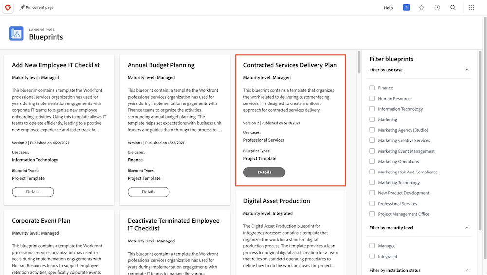

# Skapa en projektmall och lär dig mer om [!UICONTROL utkast]

Lär dig skapa en projektmall från grunden och från ett befintligt projekt, och förstå hur [!UICONTROL utkast] kan ge dig tillgång till en värld av användbara projektmallar som skapats av Workfront experter.

## Skapa en projektmall

I den här videon får du lära dig att:

* Skapa en mall från grunden
* Skapa en mall från ett befintligt projekt

>[!VIDEO](https://video.tv.adobe.com/v/335210/?quality=12&learn=on&enablevpops)

## Mallar skapade med [!UICONTROL utkast]

Workfront-användare kan använda [!UICONTROL utkast] för att skapa projektmallar. Med den här funktionen, som finns i huvudmenyn, får du tillgång till färdiga mallar som är anpassade efter en avdelning och en viss mognadsnivå. Mallarna gör det enkelt för användarna att komma igång med att skapa repeterbara projekt och samtidigt bibehålla en konsekvent design i projekt av liknande omfattning.

Alla licensierade användare kan bläddra i listan över utkast som finns i Workfront. Du kan inte använda en plan direkt när du skapar ett nytt projekt (till exempel konverterar en uppgift eller en förfrågan till ett projekt). En viktig skillnad mellan en plan och en projektmall är att en plan används för att skapa en mall, medan en mall används för att skapa ett projekt. **Planen måste installeras av en systemadministratör för att motsvarande mall ska kunna skapas.**

Om du hittar en plan som ser intressant ut kan du klicka på **[!UICONTROL Detaljer]** och läsa mer om den.

Skärmen [!UICONTROL Detaljer] förklarar mer om ritningen, inklusive installationshistoriken om ritningen har installerats.

Om planen installerades kan du klicka på **[!UICONTROL Se information]** för att få länkar till mallen som skapades och andra objekt som skapades för att stödja mallen.

Om ritningen inte har installerats än kan du begära den av systemadministratören.

## Rekommenderade självstudiekurser i detta ämne

* [Skapa ett projekt direkt från en mall](/help/manage-work/create-and-manage-project-templates/create-a-project-directly-from-a-template.md)
* [Dela en projektmall](/help/manage-work/create-and-manage-project-templates/share-a-project-template.md)
* [Kopiera ett befintligt projekt](/help/manage-work/manage-projects/copy-an-existing-project.md)
* [Inaktivera en projektmall](/help/manage-work/create-and-manage-project-templates/deactivate-a-project-template.md)
* [Redigera projektteamet i en projektmall](/help/manage-work/create-and-manage-project-templates/edit-the-project-team-in-a-project-template.md)
