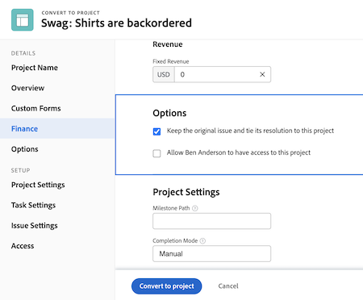

# Konvertera ärenden till andra arbetsuppgifter

## Konvertera ett problem till en uppgift

Ett problem kan vara tillräckligt viktigt för att tiden och arbetet för att lösa det ska räknas med i projekttidslinjen och tilldela lämpliga resurser. I det här fallet kan problemet konverteras till en uppgift.

![En bild av [!UICONTROL Konvertera till aktivitet] option of an issue in [!UICONTROL Workfront].](assets/15-convert-issue-to-task-menu-option.png)

1. Navigera till [!UICONTROL Problem] del av projektet eller aktiviteten som problemet är inloggat på. Eller hitta problemet i en rapport som du har tillgång till.
1. Klicka på problemnamnet för att öppna det.
1. Välj **[!UICONTROL Konvertera till uppgift]**.
1. Fyll i [!UICONTROL Konvertera till uppgift] formulär. Börja med att ge den nya aktiviteten ett namn och en beskrivning.
1. Om den nya aktiviteten ska ingå i ett annat projekt anger du projektnamnet.
1. I [!UICONTROL Alternativ] markerar du kryssrutorna för att behålla den ursprungliga utgåvan, tillåta åtkomst till den nya uppgiften och behålla slutdatumet. Följ organisationens arbetsflöde när du gör dessa val. Bifoga ett anpassat formulär om du vill överföra anpassade formulärdata från utgåvan till uppgiften. (Alla fält som finns i både utgivningsformuläret och aktivitetsformuläret överförs automatiskt till aktivitetsformuläret.)
1. Fyll i det anpassade formuläret, om det är kopplat.
1. Klicka **[!UICONTROL Konvertera till uppgift]** till slut.

![En bild av [!UICONTROL Konvertera till aktivitet] form av en emission i [!UICONTROL Workfront].](assets/16-convert-to-task-options.png)

Beroende på organisationens [!DNL Workfront] systeminställningarna kan du ändra inställningarna i avsnittet Alternativ när du konverterar uppgiften. Dessa alternativ påverkar både den ursprungliga utgåvan och den nya aktiviteten.

* **&quot;Behåll det ursprungliga problemet och knyt lösningen till detta&quot;** bevarar den ursprungliga utgåvan och tillhörande information (timmar, dokument osv.). När det här alternativet är markerat markeras problemet som löst när aktiviteten är slutförd. Om det här alternativet inte är markerat tas den ursprungliga utgåvan bort när aktiviteten har slutförts. Detta kan påverka hur organisationen spårar och rapporterar problem.
* The **&quot;Tillåt (användarens namn) att få åtkomst till den här uppgiften&quot;** kan den person som skapade problemet få åtkomst till den nya uppgiften.
* The **&quot;Behåll det planerade datumet för färdigställandet av utgåvan&quot;** kan du behålla det planerade slutförandedatumet som redan har angetts för problemet. Detta ställer in aktivitetsbegränsningen till [!UICONTROL Avsluta senast]. Om rutan inte är markerad ställs aktivitetens datum in som om en ny uppgift skapades i projektet.

Den nya uppgiften placeras längst ned i uppgiftslistan i ditt projekt. Flytta aktiviteten till önskad plats, tilldela en användare eller grupp till arbetet, lägg till planerade timmar och varaktighet osv.

>[!NOTE]
>
>Du kan inte lägga till problem i projekttidslinjen eftersom de representerar&quot;oplanerat arbete&quot;. Projektets tidslinje är för&quot;planerat arbete&quot;, dvs. uppgifter.

## Konvertera ett ärende till ett projekt

Det finns tillfällen när ett problem inte kan lösas genom att man löser själva problemet eller konverterar det till en uppgift eftersom processen att lösa problemet måste vara mer noggrant samordnad. I det här fallet kan du konvertera utgåvan till ett projekt.

1. Navigera till avsnittet Problem i projektet eller aktiviteten som problemet är inloggat på. Eller hitta problemet i en rapport som du har tillgång till.
1. Klicka på problemnamnet för att öppna det.
1. Klicka på menyn med tre punkter till höger om problemnamnet för att visa menyn Mer.
1. Välj sedan om du vill skapa ett nytt projekt som är helt tomt eller använda en projektmall som fyller i uppgifter i förväg och på tidslinjen.
1. Fyll i informationen i fönstret Konvertera till projekt med namnet på projektet.
1. Fyll i annan projektinformation som krävs av ditt team eller din organisation.
1. I avsnittet Alternativ markerar du kryssrutorna för att behålla det ursprungliga problemet och ge åtkomst till det nya projektet. Följ organisationens arbetsflöde när du gör dessa val.
1. Fyll i det anpassade formuläret, om det är kopplat. Bifoga ett anpassat formulär om du vill överföra anpassade formulärdata från ärendet till projektet. (Alla fält som finns både i utgivningsformuläret och projektformuläret överförs automatiskt till projektformuläret.)
1. Klicka **Konvertera till projekt** till slut.

Vilka projektinformationsfält som visas i fönstret Konvertera till projekt beror på vilken metod du använde för att skapa projektet. Mer information visas på den vänstra menyn om du har använt alternativet Konvertera till projekt från mall.

>[!NOTE]
>
>Vissa avsnitt, till exempel avsnittet Alternativ, är eventuellt inte tillgängliga beroende på organisationens systeminställningar för Workfront, även om de visas.

* Klicka på &quot;**Behåll det ursprungliga problemet och knyt lösningen till det här projektet**&quot;. Med det här alternativet behålls den ursprungliga utgåvan och relaterad information (timmar, dokument osv.). När det nya projektet är klart markeras problemet som löst. Om det här alternativet inte är markerat tas den ursprungliga utgåvan bort när projektet har slutförts. Detta kan påverka hur organisationen spårar och rapporterar problem.
* The &quot;**Tillåt (användarens namn) åtkomst till det här projektet**&quot;gör det möjligt för den person som skapade problemet att få åtkomst till det projekt som skapas.

## Underhåll information under konverteringsprocessen

<!-- Need link to wf one doc article below 

To learn about what information transfers when you convert an issue to a task or project, we recommend you read through the conversion considerations in the article, Convert issues. This lists what information is kept when converting issues and what isn’t. Workfront recommends you become familiar with these considerations so you don’t lose important information when converting issues to tasks or projects.

-->

Överföring av anpassade formulärdata kräver något av följande:

* Flera exemplar av samma anpassade formulär - en för utgåvan och en för uppgiften eller projektet. Fälten i dessa anpassade formulär ska vara exakt likadana, så informationen kan överföras från ett anpassat formulär till ett annat.

* Eller ett anpassat formulär där utgåva, uppgift och/eller projektobjekt väljs. Med den här metoden behöver du bara skapa och underhålla anpassade fält i ett enda anpassat formulär. Det här är en nyligen genomförd förbättring som är mycket enklare än att ha flera kopior av samma formulär, men båda metoderna fungerar.

<!-- Need link to wf one doc article below

Learn more in the article, Transfer custom form data to a larger work item.

-->

<!-- Pro tips graphic -->

Om du tar med ett anpassat formulär i en projektmall tilldelas det automatiskt när mallen väljs i konverteringsprocessen.

<!-- Learn more graphic and documentation article links 

* Convert issues
* Transfer custom form data to a larger work item
* Overview of resolving and resolvable objects
* Understanding resolving and resolvable objects
* Unlink issues from their resolvable objects

-->

## Konvertera en utgåva till en aktivitet eller ett projekt från en problemlista

Om du vill öka effektiviteten i ditt arbete och göra det enklare att konvertera problem i en snabb miljö kan du konvertera ett ärende till en aktivitet eller ett projekt från en problemlista i ett projekt, en rapport eller en kontrollpanel. Välj bara ett problem och klicka sedan på menyn med tre punkter som visas.

