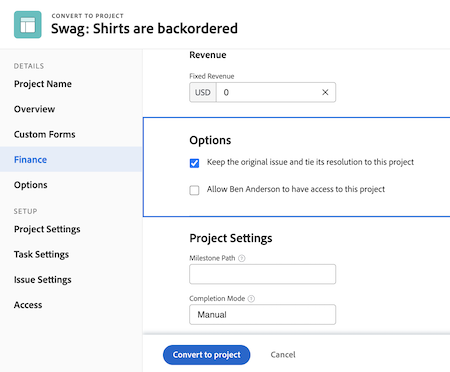

# Konvertera ett problem/en begäran till ett projekt

I den här videon får du lära dig att:

* Granska informationen som skickats in tillsammans med begäran
* Välj lämplig projektmall
* Slutför konverteringen från begäran till projekt

>[!VIDEO](https://video.tv.adobe.com/v/340343/?quality=12&learn=on)

## Vad du behöver veta om [!UICONTROL Alternativ] section

The [!UICONTROL Alternativ] -avsnittet kan vara dolt av systemadministratören om de vill att du ska använda de standardinställningar som de har angett. Om [!UICONTROL Alternativ] -avsnittet visas, här betyder alternativen:

**Behåll det ursprungliga problemet och knyt lösningen till det här projektet**

Om du väljer det här alternativet markeras det ursprungliga problemet som löst när projektet är klart. Om det här alternativet är **not** markerat tas den ursprungliga utgåvan bort när projektet skapas.

**Tillåt (användarens namn) åtkomst till det här projektet**

Om det här alternativet är markerat får den person som gjorde begäran (eller för vem som gjorde begäran) automatiskt åtkomst till det nya projektet när det har skapats. Om det här alternativet är **not** om du väljer det här alternativet får de inte automatiskt några rättigheter.

## Underhåll information under konverteringsprocessen

Överföring av anpassade formulärdata kräver antingen:

* Flera exemplar av samma anpassade formulär - en för utgåvan och en för uppgiften eller projektet. Fälten i dessa anpassade formulär ska vara exakt likadana, så informationen kan överföras från ett anpassat formulär till ett annat.

* Du kan använda ett anpassat formulär där alla utgåva-, uppgifts- och/eller projektobjekt är markerade. Med den här metoden behöver du bara skapa och underhålla anpassade fält i ett enda anpassat formulär. Det är mycket enklare än att ha flera kopior av samma formulär, men båda metoderna fungerar.

Om du tar med ett anpassat formulär i en projektmall tilldelas det automatiskt när mallen väljs i konverteringsprocessen.

## Konvertera en utgåva till en aktivitet eller ett projekt från en problemlista

Om du vill öka effektiviteten i ditt arbete och göra det enklare att konvertera problem i en snabb miljö kan du konvertera ett ärende till en aktivitet eller ett projekt från en problemlista i ett projekt, en rapport eller en kontrollpanel. Välj bara ett problem och klicka sedan på den 3-punktsmeny som visas.

