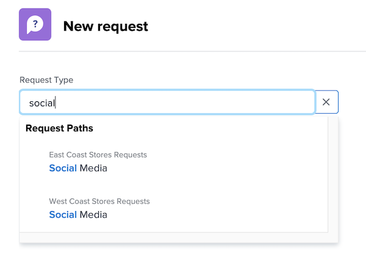
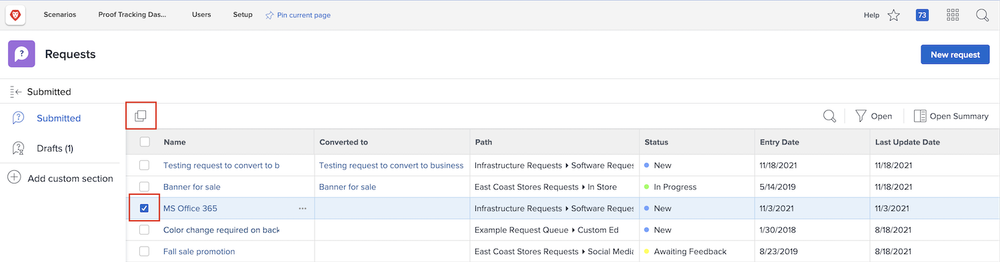

# Gör en förfrågan

I många organisationer är det första steget i att starta ett nytt projekt, utveckla en ny produkt eller skapa en slutprodukt att göra en förfrågan i [!DNL Workfront]. Du kan följa förloppet för begäran och ange ytterligare information vid behov.

I den här videon får du lära dig att:

* Navigera till begärandeområdet
* Gör en förfrågan
* Visa skickade begäranden
* Hitta ett utkast till en begäran

>[!VIDEO](https://video.tv.adobe.com/v/336092/?quality=12)

## Hitta kösökvägarna snabbt och enkelt

När du klickar på [!UICONTROL Typ av begäran] de tre senaste begärandesökvägarna som du nyligen skickade visas automatiskt högst upp i listan. Välj ett alternativ för att arkivera en annan begäran i samma kö.

Längst ned i listan finns alla begärandeköer som du har åtkomst till. Om du är osäker på vilken kö du ska använda för din begäran kan du använda nyckelordssökningen för att snabbt och enkelt hitta den du behöver.

När du skriver nyckelord [!DNL Workfront] öppnar matchningar så att du kan hitta den kösökväg som passar dina behov. Om du till exempel vill göra en begäran om ett inlägg i sociala medier börjar du skriva&quot;sociala medier&quot; i [!UICONTROL Typ av begäran] och listan uppdateras dynamiskt för att visa eventuella träffar.

Välj önskat alternativ, fyll i formuläret och skicka begäran.

## Kopiera en skickad begäran för att göra en ny begäran

När du skickar in samma typ av begäran ofta är det tidskrävande att skapa varje ny begäran och fylla i samma information om och om igen. Snabba upp processen genom att kopiera en befintlig begäran, ändra bara den information som behöver uppdateras och skicka den som en ny begäran.

1. Klicka på Begäranden på huvudmenyn.
1. Se till att du är i avsnittet Skickat genom att kontrollera den vänstra panelmenyn.
1. Sök efter och markera den begäran som du vill kopiera. Du kan bara kopiera en begäran åt gången.
1. Klicka på ikonen Kopiera och skicka som ny längst upp till vänster i listan med begäranden.
1. Fönstret Ny begäran öppnas med fältet Ämne markerat så att du kan namnge den nya begäran.
1. Uppdatera annan information i begäran efter behov.
1. Klicka på Skicka för att slutföra.
1. Den kopierade begäran skickas som en ny begäran och visas i listan Skickat.

Du kan kopiera en begäran som du tidigare har skickat, men du kan inte kopiera ett utkast av en begäran. Du kan kopiera en begäran som har skickats av någon annan så länge du har åtkomst till den via Visa.

<!---
Learn more
Requests area overview
Create and submit Workfront requests
Guides
Make a work request
--->
