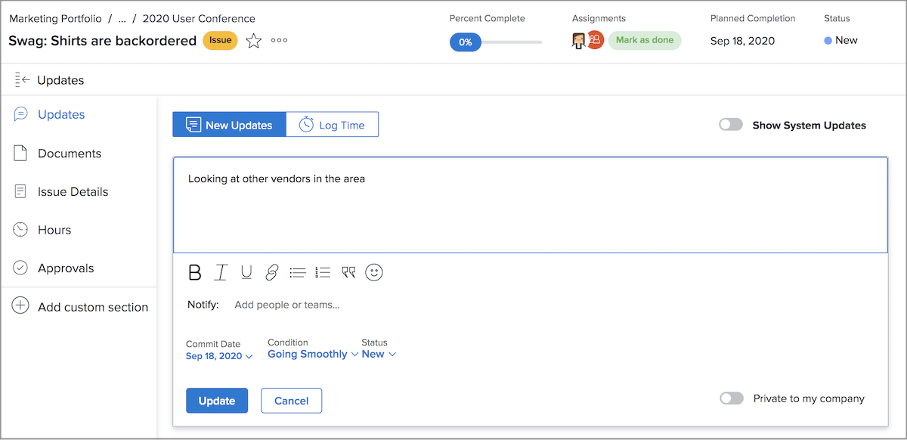

# Hantera ärenden

## Tilldela ett ärende

Logga in problemet [!DNL Workfront] är det första steget mot att lösa problem som uppstår. Nästa steg är att tilldela ett problem till en enskild användare, flera användare eller ett team så att allt tillhörande arbete kan slutföras och problemet kan lösas.

Tilldela ett problem är som att tilldela en uppgift - fyll i [!UICONTROL Uppdrag] fält. Problemet uppstår sedan i den som tilldelas avtalet [!UICONTROL Arbetslista] in [!DNL Workfront] [!UICONTROL Startsida]. Om den tilldelas ett team visas den i [!UICONTROL Teamförfrågningar] i [!UICONTROL Team] sida.

Alla problem som loggats in och själva projektet kan nås via [!UICONTROL Problem] på projektsidan. På så sätt kan projektledare, planerare och andra snabbt tilldela ärenden som rör projektet.

Det finns flera sätt att tilldela problem i [!DNL Workfront].

* Gå till [!UICONTROL Problem] -avsnittet i projektet eller uppgiften. Klicka på [!UICONTROL Uppdrag] om du vill aktivera redigeringen online anger du namnet på den användare, de användare eller det team som ska slutföra arbetet.
Du kan också använda redigeringen online när du visar problem på en [!DNL Workfront] rapport.

* Klicka på namnet på utgåvan, antingen i en rapport eller i **[!UICONTROL Problem]** del av projektet eller uppgiften. Klicka sedan på **[!UICONTROL Uppdrag]** i sidhuvudet, längst upp till höger i fönstret. Glöm inte att klicka på **[!UICONTROL Spara]** efter att ha angett ett användar- eller teamnamn.

![En bild av det infogade redigeringsalternativet när du klickar på [!UICONTROL Uppdrag] emissionsfält](assets/04-issue-assign-issue-list-assignments-field.png)

<!--
Learn more graphic and documentation article links
Assign issues
Edit user assignments for multiple issues
-->

## Tar emot en utleveranstilldelning

Du hittar problem som du har tilldelats i [!UICONTROL Arbetslista] in [!UICONTROL Startsida].

![En bild av en problemtilldelning i [!UICONTROL Arbetslista] in [!UICONTROL Startsida]](assets/05-workfront-home-work-list.png)

Använd [!UICONTROL Filter] om du vill begränsa listan så att du bara kan visa problem, om du vill.

![En bild av [!UICONTROL Filter] i [!UICONTROL Arbetslista] in [!UICONTROL Startsida]](assets/06-workfront-home-issue-filter.png)

När ett ärende tilldelas ett team visas det i [!UICONTROL Teamförfrågningar] i [!UICONTROL Team] sida. En teammedlem kan klicka på [!UICONTROL Arbeta på den] om du vill godkänna uppdraget eller en gruppledare kan klicka på [!UICONTROL Tilldela] -ikon för att skicka begäran till en viss person.

![En bild av [!UICONTROL Teamförfrågningar] i [!UICONTROL Team] page](assets/07-team-page-work-on-it.png)

Problem som tilldelats teamet visas även på [!UICONTROL Schema] -avsnitt. Detta gör att teamleads och andra kan se vad teammedlemmarna arbetar med innan de tilldelar arbetet. Dra och släpp problemfältet från [!UICONTROL Ej tilldelad] till en gruppmedlems kalender för att tilldela den.

![En bild på grupptilldelningar i [!UICONTROL Schema] -avsnitt.](assets/08-issue-assignment-team-schedule.png)

Beroende på hur organisationen har [!DNL Workfront] kan du även se problem som tilldelats dig eller ditt team i en rapport som ingår i en kontrollpanel.

<!-- Learn more graphic and documentation article links

* Display items in the [!UICONTROL Work List] in the [!UICONTROL Home] area
* Manage work and team requests in the [!UICONTROL Home] area

-->

## Uppdatera förloppet för problem

Du och dina teammedlemmar kan publicera uppdateringar och logga timtals på frågor för att ge insyn i det arbete som utförs och hålla alla inblandade uppdaterade om arbetets förlopp.

Eftersom det finns flera sätt att publicera uppdateringar på [!DNL Workfront]följer du teamets specifika anvisningar för det sätt som rekommenderas för att arbeta med systemkonfigurationer och arbetsflöden.

Uppdateringar och timmar kan bokföras på utleveransen från [!UICONTROL Startsida]. Klicka **[!UICONTROL Nya uppdateringar]** för att publicera en kommentar.

![En bild av hur du bokför en uppdatering för ett ärende från [!UICONTROL Startsida].](assets/09-workfront-home-update.png)

När du kommenterar ett problem kan du dirigera meddelandet till andra användare eller team med funktionen @name, på samma sätt som du kan på sociala medier.

Klicka på **[!UICONTROL Loggtid]** för att registrera timmarna du arbetade med problemet.

![En bild av hur du loggar timmar på ett problem från [!UICONTROL Startsida].](assets/10-workfront-home-log-hours.png)

Du kan också öppna problemet (klicka på namnet) och registrera dina uppgifter där.

## Prenumerera på en utgåva

Alla som har åtkomst till utgåvan kan [!UICONTROL Prenumerera] som skickar ett meddelande till dem varje gång en uppdatering/kommentar görs om problemet. Du får inga meddelanden när timmar loggas, statusändringar eller andra ändringar görs.

Att prenumerera är ett bra sätt för andra teammedlemmar eller projektledare att spåra arbete som de är intresserade av men inte har tilldelats eller arbetar aktivt med.

<!-- Learn more graphic and link to documentation article

* Update or edit a work item in the Home area

-->

## Uppdatera utgivningsstatus

Förutom att lägga in kommentarer eller logga timmars måste du ändra status på problemet för att ange att du arbetar med det. Och ändra den sedan igen för att ange att arbetet är klart.

Ändra status i rubriken från [!UICONTROL Startsida] eller när du har öppnat sidan för utgåva.

### Olösta problem

Ett problem anses vara olöst när statusen inte har uppdaterats till fullständig eller motsvarande.

Olösta problem förhindrar att uppgiften som är kopplad till markeras som slutförd, och att projektstatusen ställs in på slutförd.

<!-- Learn more graphic and documentation article link

* Mark a work item as done in the Home area

-->

## Ytterligare funktioner

På sidan med problem får du tillgång till ytterligare information och funktioner som teammedlemmar och projektledare kan behöva för att kunna registrera och hantera problemet.

Förutom [!UICONTROL Uppdateringar] och [!UICONTROL Timmar]kan du komma åt annan information från den vänstra panelmenyn när du har öppnat problemet.

* **[!UICONTROL Dokument]**—Överför och granska dokument om problemet.
* **[!UICONTROL Ärendeinformation]**—Ändra probleminformation som beskrivning, prioritet, allvarlighetsgrad och planerat slutdatum.
* **[!UICONTROL Godkännanden]**- Ställ in en godkännandeprocess för enstaka användning för problemet eller tillämpa en global godkännandeprocess. Du kan också följa godkännandeförloppet i det här avsnittet.

Hitta alternativen för att kopiera, ta bort eller dela ett problem på menyn med tre punkter till höger om problemets namn.

<!-- Learn more graphic and documentation article links

* Edit issues
* Copy issues
* Share an issue
* Move issues
* Grant access to an issue

-->
