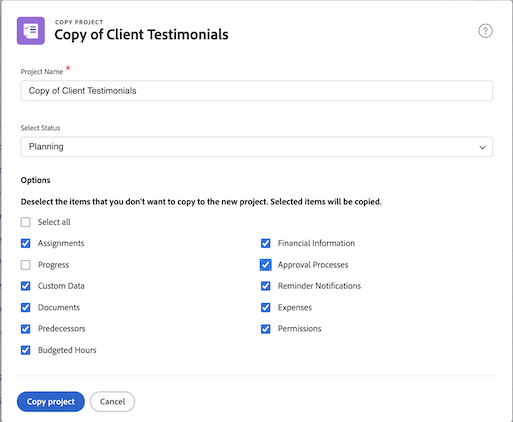

# Kopiera ett befintligt projekt

I stället för att använda en mall för att skapa ett projekt behöver du ibland bara kopiera ett projekt för en annan engångsanvändning. För att kunna göra detta måste du ha en planlicens med behörigheten Redigera och Skapa för projekt.

Navigera till projektet som du vill kopiera och klicka på menyn med tre punkter bredvid projektnamnet. Välj sedan Kopiera.

I fönstret Kopiera projekt kan du ändra titel och status samt rensa olika data som är kopplade till projektet, t.ex. uppdrag, dokument och anpassade data.

Om du väljer Rensa uppdrag och/eller anger status till Planning förhindrar du att det kopierade projektet skickar meddelanden om aktivitetstilldelning direkt efter kopiering.
