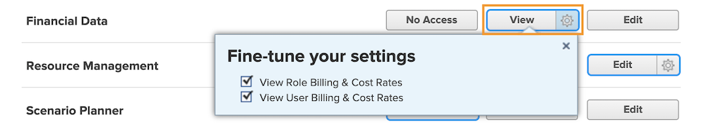

# Förstå finansiell åtkomst

Om din organisation samlar in ekonomiska data med [!DNL Workfront]Som systemadministratör är det ditt ansvar att skydda och hantera vem som har åtkomst för att visa och redigera informationen.

Två saker är nödvändiga för att en användare ska kunna visa eller redigera ekonomisk information:

1. Åtkomsträttigheter måste aktiveras i [!UICONTROL Åtkomstnivå].
2. Tillstånd att använda dessa åtkomsträttigheter måste beviljas objekt för objekt.

En användare kan till exempel få behörighet att visa ekonomiska data på åtkomstnivå, men kan bara visa ekonomiska data för en uppgift som både delas med användaren och finansiell visning aktiveras när uppgiften delas.

Det är alltså möjligt för en användare med [!UICONTROL Åtkomstnivå] behörighet att visa ekonomiska uppgifter för att kunna se ekonomiska resultat för vissa objekt och inte för andra, beroende på dessa objekts individuella delningsalternativ. Ingen användare kan dock visa ekonomiska data för något objekt såvida de inte har den behörighet som de har i sina [!UICONTROL Åtkomstnivå].

## [!UICONTROL Åtkomstnivå] inställningar

Allmän tillgång till finansiella uppgifter ges först av [!DNL Workfront] licenstyp.

**[!UICONTROL Plan] licenser kan**

* Hantera faktureringsposter
* Hantera och visa rollfakturering och kostnadstariffer
* Hantera och visa fakturering och kostnadstariffer för användare
* Hantera utgifter
* Visa och redigera ekonomi

**[!UICONTROL Arbete] licenser kan**

* Hantera utgifter
* Visa finanser

**[!UICONTROL Granska] licenser kan**

* Visa finanser

**Behörigheter kan ändras av [!UICONTROL Åtkomstnivå]. De tre alternativen för åtkomst av finansiella data är:**

* [!UICONTROL Ingen åtkomst] — Användaren kan inte se ekonomisk information.
* [!UICONTROL Visa] — Användare kan granska och dela informationen.
* [!UICONTROL Redigera] — Användare kan skapa, redigera, ta bort och dela informationen. (Endast tillgängligt för en planlicens.)

Observera att [!UICONTROL Visa] och [!UICONTROL Redigera] det finns ytterligare inställningar för [!UICONTROL Plan] licens. Klicka på kugghjulet på [!UICONTROL Visa] för dessa alternativ:

**[!UICONTROL Visa]**

* Visa fakturering och kostnadstariffer för roller
* Visa fakturering och kostnadstariffer för användare

**[!UICONTROL Redigera]**

Dessa två alternativ är tillgängliga under [!UICONTROL Redigera] alternativ, tillsammans med:

* Redigera rollfakturering och kostnadstariffer
* Redigera fakturering och kostnadstariffer för användare

>[!NOTE]
>
>En användare som har tillgång till att lägga till utgifter kan även visa de utgifter de lägger till samt de utgifter som läggs till i deras direktrapporter.
