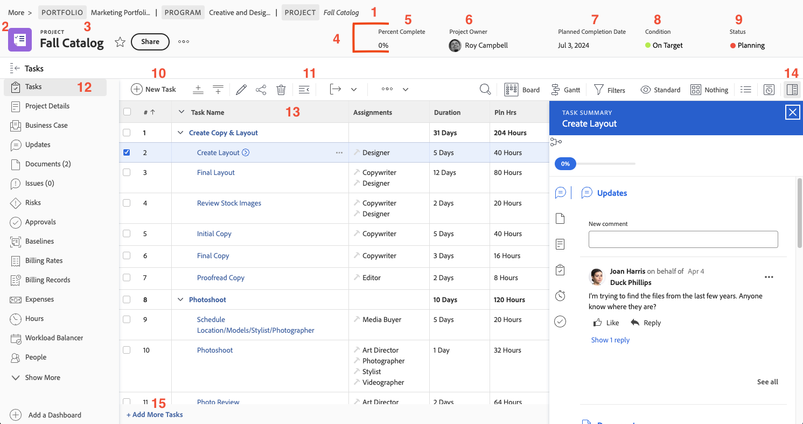

# Navigera på projektsidan

I den här videon får du en översikt över hur du navigerar och hanterar projektsidan i Workfront. &#x200B; Viktiga funktioner:

* **Projekthuvud:** Visar viktig information, t.ex. Procent färdigt, Projektledare, planerat slutförandedatum, projektvillkor och status. &#x200B; Statusen hjälper till att spåra projektets fas och utlöser meddelanden. &#x200B;
* **Navigering i sidled:** Visar projektets placering i organisationens program och portfölj, med klickbara länkar för enkel navigering. &#x200B;
* **Favoriter och meny:** Favoriter-stjärnan bokmärker projektet så att det går snabbt att komma åt det. Menyn innehåller alternativ som att redigera detaljer, kopiera projektet och beräkna om tidslinjer. &#x200B;
* **Aktivitetslista:** Representerar steg i projektplanen. &#x200B; Använd snabbfilter för att hitta uppgifter, redigera direkt för snabba ändringar och i Sammanfattningspanelen för detaljerad information. &#x200B; När du klickar på ett aktivitetsnamn öppnas dess dedikerade sida. &#x200B;
* **Vänster panel:** Ger åtkomst till olika projektavsnitt, till exempel information, uppdateringar och dokument. &#x200B; Panelen kan anpassas av systemadministratören. &#x200B;
* **Uppdateringsavsnitt:** Centraliserar kommunikationen om projektet, vilket gör det möjligt att tagga användare, svara på kommentarer och visa sammanslagna uppdateringar från aktiviteter, utgåvor och dokument. &#x200B;
* **Avsnitt för dokument:** Möjliggör överföring och hantering av projektrelaterade filer och korrektur. &#x200B; Dokument som är kopplade till uppgifter kan sammanfogas till projektnivån för enkel åtkomst. &#x200B;

>[!VIDEO](https://video.tv.adobe.com/v/335085/?quality=12&learn=on&enablevpops)

## Viktiga uppgifter

* **Översikt över projekthuvudet:** Få snabbt tillgång till viktig projektinformation som procent färdigt, projektledare, förfallodatum, status och villkor. &#x200B; Statusen styr även meddelanden och arbetsflödesfaser. &#x200B;
* **Aktivitetshantering:** Använd uppgiftslistan för att spåra projektsteg, använda snabbfilter för att hitta uppgifter och göra infogade redigeringar. &#x200B; Detaljerad information om arbetsmomenten finns på sammanfattningspanelen eller aktivitetssidan. &#x200B;
* **Navigering för vägbeskrivningar:** Navigera i projektets hierarki inom organisationen med hjälp av klickbara länkar i spårningsinformationen. &#x200B;
* **Centraliserade uppdateringar:** Alla uppdateringar från aktiviteter, utgåvor och dokument samlas i avsnittet för projektuppdateringar, vilket förenklar kommunikation och spårning. &#x200B;
* **Dokumentorganisation:** Överför och hantera projektrelaterade filer och korrektur i dokumentavsnittet och kontrollera att relevanta dokument bifogas till uppgifter för smidigt samarbete. &#x200B;

## Viktiga delar av projektsidan

[Klicka här](/help/assets/key-parts-of-the-project-page.pdf) om du vill hämta en PDF av den här sidan.

Projektsidan innehåller många funktioner som hjälper dig att hantera arbetet. Arbeta med systemadministratören om det finns ett alternativ som du behöver men som inte visas i din instans av [!DNL Workfront]. Här är några av huvudfunktionerna på projektsidan som du bör tänka på.

1. **Spårspår:** Navigera genom program- och portföljhierarkin bakom projektet.
2. **Objekttyp:** Om du visar objekttypen på landningssidan kan du identifiera vad du tittar på i [!DNL Workfront]. Projekttermen kan anpassas av din [!DNL Workfront]-systemadministratör.
3. **Projektnamn:** Namnet på det projekt som du visar. Klicka på namnet för att redigera det.
4. **Projekthuvud:** Standardinformation som är tillgänglig på alla projektsidor.
5. **[!UICONTROL Procent färdigt]:** Det här uppdateras automatiskt baserat på de uppgifter som har slutförts i projektet.
6. **[!UICONTROL Projektägare]:** För de flesta organisationer är detta projektledare. Detta är den person som ansvarar för att hantera projektet i [!DNL Workfront] och se till att det är klart.
7. **[!UICONTROL Planerat slutförandedatum]:** Det planerade slutförandedatumet för projektet anges av projektledaren via projekttidslinjen.
8. **[!UICONTROL Villkor]:** [!UICONTROL Villkor] är en visuell representation av hur projektet fortskrider. [!DNL Workfront] kan automatiskt konfigurera [!UICONTROL Villkor] baserat på förloppsstatusen för aktiviteterna i projektet. Eller så kan [!UICONTROL Villkor] anges manuellt via projektinformationen.
9. **[!UICONTROL Status]:** [!UICONTROL Status] anger var projektet står i processen: är projektet fortfarande planerat, pågår eller är projektet färdigt.
10. **[!UICONTROL Ny aktivitet]:** Klicka för att skapa en aktivitet i projektet. Uppgiften genereras längst ned i listan.
11. **[!UICONTROL Exportera]:** Exportera uppgiftslistan eller markerade uppgifter till en PDF-, kalkylblads- eller tabbavgränsad fil.
12. **Vänster panelmeny:** Navigera till annan information om projektet med den vänstra panelen. Klicka på ikonen Uppgift längst upp för att komprimera panelen om du behöver lite mer utrymme på skärmen. Dra och släpp ikonerna så att du kan arbeta effektivt. De alternativ du ser anges av din [!DNL Workfront]-systemadministratör.
13. **Uppgiftslista:** Uppgiftslistan innehåller alla aktiviteter som ingår i din projektplan. Vilken information som visas för varje uppgift avgörs av den valda vyn.
14. **Panelen Sammanfattning:** Här kan du snabbt se information om den valda aktiviteten. Klicka på ikonen för den sammanfattande panelen för att öppna eller stänga den.
15. **Lägg till fler aktiviteter** Klicka här om du vill lägga till en annan uppgift längst ned i uppgiftslistan med hjälp av intern redigering.

## Rekommenderade självstudiekurser i detta ämne

* [Förstå grundläggande projektskapande](/help/manage-work/projects/understand-basic-project-creation.md)
* [Lär dig fyra sätt att skapa ett projekt](/help/manage-work/projects/understand-other-ways-to-create-projects.md)
* [Fyll i projektinformationen](/help/manage-work/projects/fill-in-the-project-details.md)

