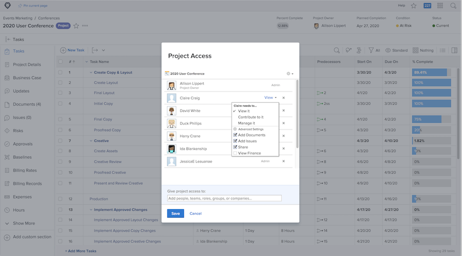

# Dela ett projekt

Att ge intressenter och medarbetare insyn i projektet är en viktig del i hanteringen av ett projekt.

Se till att alla kan se den information de behöver genom att dela projektet. I Workfront görs detta med [!UICONTROL Dela] alternativ. Du kan göra detta från det enskilda projektet, från [!UICONTROL Mer] i sidhuvudet.

Du kan också dela flera projekt samtidigt från listan med projekt på [!UICONTROL Projekt] genom att markera projekten och klicka på [!UICONTROL Dela] -knappen.

Genom att dela projektet kan alla inblandade se projektinformation när de behöver den.

<!---
Learn More Icon
Share permissions on objects
Share a project
--->
