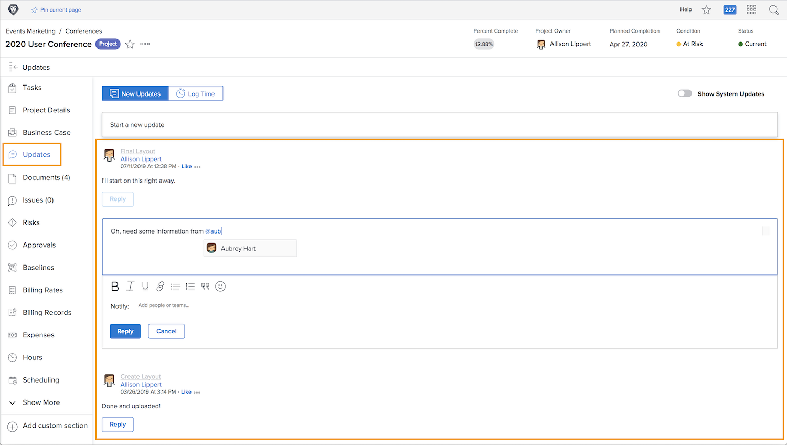

# Förstå projektkommunikation

Som talesättet säger är kommunikation 90 procent av allt. Kommunikation med projektteamet, chefer och projektintressenter.

Men när projektteamen använder e-post, snabbmeddelanden, möten och anteckningar för projektkommunikation sprids informationen ... eller ännu värre, glöm. Håll kommunikationen om själva projektarbetet i [!DNL Workfront] med uppdateringar.

När projektmedlemmarna arbetar med uppdrag kan de göra uppdateringar från [!DNL Workfront] [!UICONTROL Startsida] på de uppgifter de tilldelats.

Uppdateringar från uppgifter, utgåvor och dokument samlas på projektnivå [!UICONTROL Uppdateringar] -fliken, vilket gör informationen snabb och enkel att visa.

Sedan kan du svara på uppdateringar genom att klicka på knappen. Detta håller alla samtal på ett ställe, så att du kan återkomma till det senare.

<!---
learn more urls
Communicate about work in Home
Subscribe to items in Workfront
Update work
--->
