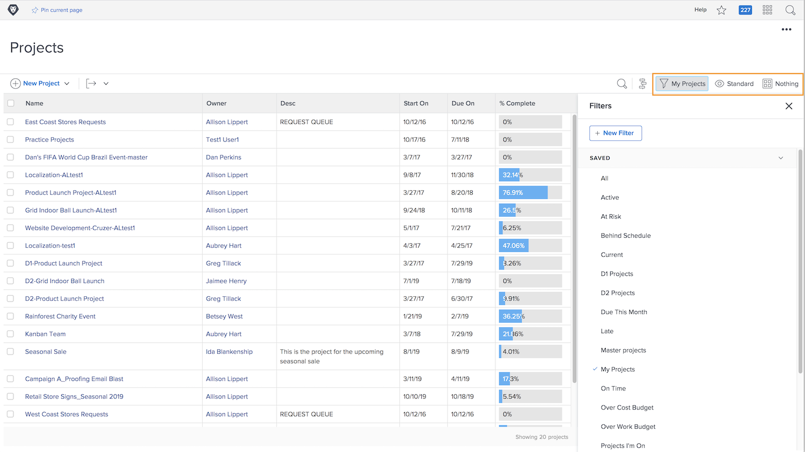
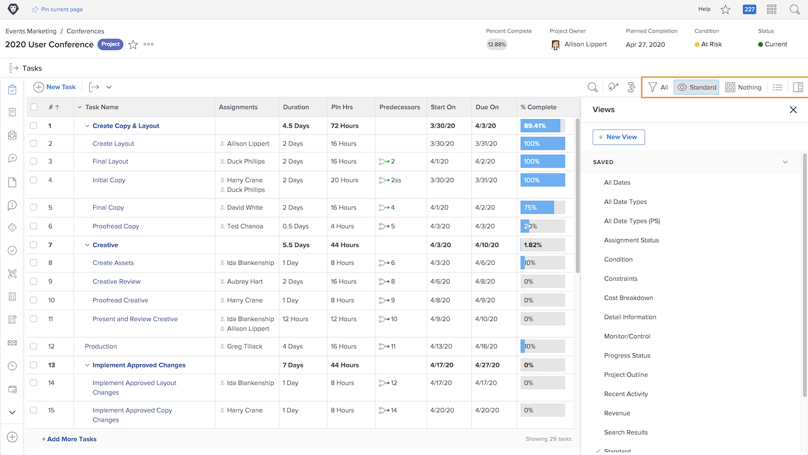

# Visa projektinformation

Oavsett om du tittar på huvudsidan [!UICONTROL Projekt] sida eller i ett enskilt projekt, finjustera listan för att se den information du behöver med [!UICONTROL Filter], [!UICONTROL Vyer]och [!UICONTROL Grupperingar].

Du kan få en högnivåbild av hur alla dina projekt fortskrider i [!UICONTROL Projekt] sida.

Använd [!UICONTROL Filter] för att begränsa listan utifrån vissa kriterier. Välj sedan en [!UICONTROL Visa] för att visa kolumner med information som är relevant för dina projekt. Välj en [!UICONTROL Gruppering] för att ordna projekten på ett sätt som passar dig.

När du är på [!UICONTROL Uppgifter] del av ett projekt, använda [!UICONTROL Filter], [!UICONTROL Vyer]och [!UICONTROL Grupperingar] igen för att hjälpa dig att övervaka arbetet. Eftersom du tittar på uppgifter istället för projekt har du en helt annan uppsättning alternativ.

Många [!DNL Workfront] kunderna skapar anpassade vyer som visar anpassad formulärinformation och andra fält som är relevanta för det arbete som utförs.

## Lär dig skapa egna filter, vyer och grupperingar

[Skapa ett enkelt filter](https://experienceleague.adobe.com/docs/workfront-learn/tutorials-workfront/reporting/basic-reporting/create-a-basic-filter.html?lang=en)

[Skapa en grundvy](https://experienceleague.adobe.com/docs/workfront-learn/tutorials-workfront/reporting/basic-reporting/create-a-basic-view.html?lang=en)

[Skapa en grundläggande gruppering](https://experienceleague.adobe.com/docs/workfront-learn/tutorials-workfront/reporting/basic-reporting/create-a-basic-grouping.html?lang=en)
