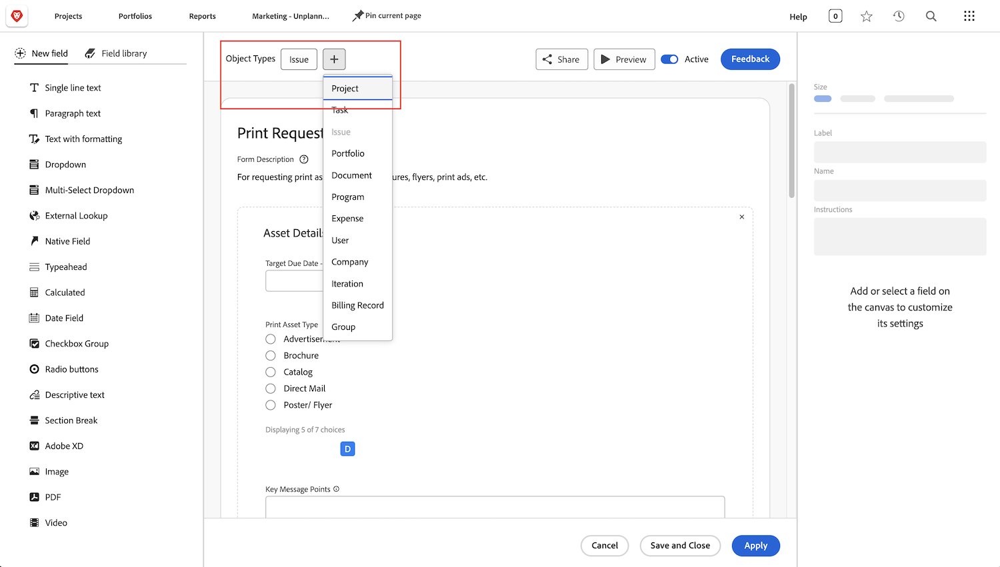

# Svar på vanliga frågor om begärandeköer

**Varför kan jag se en begärandekö, men min användare kan inte det?**

På fliken [!UICONTROL Köinformation] i kön/projektet för din begäran kontrollerar du att användaren uppfyller villkoren för &quot;Vem kan lägga till begäranden i den här kön?&quot; fält.

I den här videon finns mer information:

>[!VIDEO](https://video.tv.adobe.com/v/3434156/?quality=12&learn=on)

**Jag gav användarna åtkomst till kön, men nu kan de även se begärandeköprojektet. Varför?**

I dialogrutan &quot;Vem kan lägga till begäranden i den här kön?&quot; Om du väljer &quot;Personer med visningsåtkomst till det här projektet&quot; kan alla som du ger vybehörighet till för att använda frågekön även visa begärandekön i en projektlista. Du kan undvika detta genom att använda alternativet Personer i det här projektets företag eller alternativet Personer i det här projektets grupp.

**Kan jag omvandla en begäran till ett projekt?**

Ja. Du kan konvertera utgåvor till aktiviteter eller projekt beroende på vad som behövs.

De här självstudiekurserna visar hur du gör:

* [Konvertera ett problem/en begäran till ett projekt](/help/manage-work/issues-requests/create-a-project-from-a-request.md)

* [Konvertera ett problem/en begäran till en uppgift](/help/manage-work/issues-requests/convert-issues-to-other-work-items.md)

**Var hittar jag en begärandekö att redigera?**

Du kan använda fältet [!UICONTROL Sök] i navigeringsfältet eller söka efter det i området [!UICONTROL Projekt] .

Om du öppnar en begäran från begärandekön kan du klicka på projektnamnet i området för vägbeskrivningar.

**Kan jag överföra informationen från ett anpassat begärandeformulär till ett anpassat projektformulär?**

Ja. När du skapar ett anpassat formulär väljer du både [!UICONTROL Projekt] och [!UICONTROL Problem] som objekttyper. Du kan också redigera ett anpassat projektformulär så att det innehåller problemobjektstypen och vice versa.

Bifoga det anpassade formuläret till begäran. När du konverterar begäran till ett projekt bifogas det anpassade formuläret automatiskt till det nya projektet och värdena i fälten visas både i det begärda formuläret och i de anpassade projektformulären.

**Jag tittar på ett projekt eller en aktivitetsrapport. Hur kan jag ta reda på vilken begäran det här objektet kommer från?**

Du kan komma åt fält i fälten **[!UICONTROL Konverterat problem]** och **[!UICONTROL Konverterat ärende-original]** för att lägga till den informationen i projekt- och aktivitetsrapporter.

I den här videon finns mer information:

>[!VIDEO](https://video.tv.adobe.com/v/3434176/?quality=12&learn=on)

**Vilket är det bästa sättet att filtrera efter begärandeköer i en rapport?**

Om ditt projektfilter innehåller **Kö>>Är offentlig>>Lika>>Inget** visas endast projekt som är **NOT**-begärandeköer i rapporten.

Om ditt projektfilter innehåller **Kö>>Är offentlig>>Inte lika med>>Ingen** visas endast projekt som **ARE**-frågeköer för.

I den här videon finns mer information:

>[!VIDEO](https://video.tv.adobe.com/v/3434329/?quality=12&learn=on)

**Är det en bra idé att skapa en anpassad status för begärandekön?**

Vissa kunder skapar en anpassad status för Begärandekö som är lika med Aktuell. De kan sedan köra en rapport som visar alla begärandeköer eller enkelt utesluta begärandeköer från en rapport. Även om detta har fördelen att det är mer användarvänligt än att använda **Kö>>Är offentligt>>Inte lika>>Inget** har det nackdelen att användare som skapar begärandeköer glömmer att använda det, eftersom den aktuella statusen fungerar lika bra och är vad de kommer att se i de flesta utbildningsmaterialet. Därför väljer många kunder att inte använda den anpassade statusen Begärandekö.

Om du redan använder status för frågekö i din organisation och bara vill se till att den används korrekt (eller åtgärda fall där den inte används), kan du skapa rapporten **Aktiva frågeköar** som beskrivs i videon ovan och ändra filtret för **Projekt>>Status är lika med>>Aktuell** till **Projekt> Status> lika med>>Aktuell**. Då visas alla aktiva begärandeköer som använder statusen Aktuell i stället för den status för begärandekö som du vill att de ska använda. Markera alla projekt som visas och gör en massredigering för att ändra status till Begärankö.

## Rekommenderade självstudiekurser i detta ämne

* [Förstå begärandeköer](/help/manage-work/request-queues/understand-request-queues.md)
* [Skapa en begärandekö](/help/manage-work/request-queues/create-a-request-queue.md)
* [Förstå inställningarna för ett begärandeflöde](/help/manage-work/request-queues/understand-settings-for-a-flow-request.md)
* [Skapa ett begärandeflöde](/help/manage-work/request-queues/create-a-request-flow.md)
* [Skapa en kö för feedback från systemadministratörer](/help/manage-work/request-queues/create-a-system-admin-feedback-request-queue.md)
