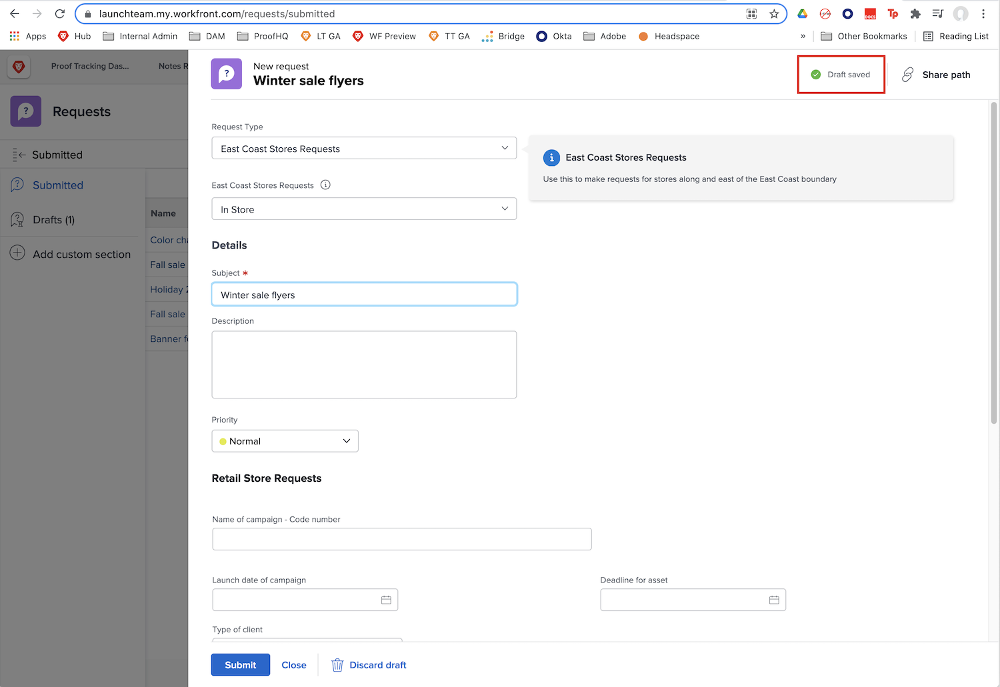

# Förstå begärandeköer

I den här videon får du lära dig:

* Skicka en begäran via en [!DNL  Workfront] begärandekö
* Hur begärandeköer är strukturerade

>[!VIDEO](https://video.tv.adobe.com/v/335220/?quality=12&learn=on)

## Begär att utkast sparas automatiskt

När du börjar fylla i ett begärandeformulär [!DNL Workfront] sparar ett utkast automatiskt när du har fyllt i [!UICONTROL Ämne] fält. Det innebär att du inte förlorar data om du behöver navigera bort från [!UICONTROL Begäranden] området för att göra något annat eller om du behöver göra en paus mitt i din förfrågan för att samla in mer information.

En indikation visas om att utkastet har sparats högst upp i fönstret. [!DNL Workfront] sparar ett utkast av din begäran, även om de obligatoriska fälten inte har fyllts i ännu.

När du är redo att skicka begäran kan du hitta den i [!UICONTROL Utkast] -fliken. Klicka på namnet för att öppna det och fylla i formuläret. Klicka sedan på [!UICONTROL Skicka begäran] när du är klar.

## Din tur

Låt oss titta lite på den information du just fick.

**Fråga:** Hur gör du en förfrågan i Workfront? Visa stegen i ordning.

* Välj den typ av begäran som du vill göra
* Klicka på Skicka begäran
* Fyll i informationen i formuläret
* Klicka på Ny begäran
* Navigera till begärandeområdet

**Svar:** Navigera till begärandeområdet > Klicka på Ny begäran > Välj den typ av begäran som du vill göra > Fyll i informationen i formuläret > Klicka på Skicka begäran

**Fråga:** En förfrågan är en..

**Svar:** Problem

<!---
You can also access request drafts from the [!UICONTROL Select a Request Type] menu at the top of the window. Select an option from the [!UICONTROL Recent Drafts] section, or start a new request by picking a queue from the [!UICONTROL New Requests] section. Fill everything out like normal, then submit the request.

<!---
image
--->

<!---
Let's take a minute to review the information you were just presented.

How do you make a request in Workfront? List the steps in order.
Choose the request type you need to make
Click Submit request
Fill out the information on the form
Click "New Request"
Navigate to the request area

Answer: Navigate to the request area>Click New Request>Choose the request type you need to make>Fill out the information on the form>Click Submit request

A request is really an......

Answer: Issue
--->
