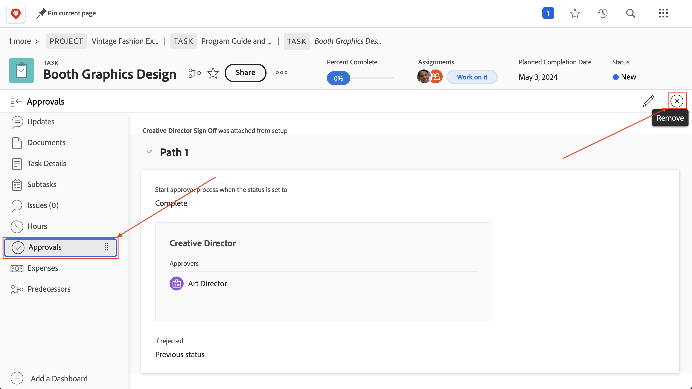

# Fullständiga godkännanden

Godkännanden av uppgifter och ärenden ingår i många projekt. Men olösta godkännanden hindrar dig från att ange projektstatus till Fullständigt.

Så här hittar du dem och hanterar dem.

I avsnittet [!UICONTROL Aktivitet] i ditt projekt väljer du en [!UICONTROL vy] som innehåller kolumnen [!UICONTROL Status], till exempel vyn [!UICONTROL Status]. En snabbtitt på den kolumnen visar om det finns ett ofullständigt godkännande för en aktivitet med orden [!UICONTROL  - Väntande godkännande ] efter statusens namn.

När du hittar en uppgift som fortfarande väntar på godkännande har du två alternativ:

## Slutför godkännandet

Detta kan innebära att man påminner den person som tilldelats det utestående godkännandet. Du kan se vem som har tilldelats som godkännare genom att öppna uppgiften och klicka på menyn med tre punkter i godkännandeområdet.

En ruta med tilldelad godkännare visas.

## Ta bort godkännandet

Om godkännandet inte behövs kan du ta bort det. Du kan göra detta genom att återkalla godkännandet. Klicka på knappen [!UICONTROL Återkalla] i godkännandeområdet. Detta ändrar statusen tillbaka till dess tidigare status och gör att du kan ta bort godkännandeprocessen.

Klicka nu på fliken [!UICONTROL Godkännanden] till vänster och sedan på knappen [!UICONTROL Ta bort] uppe till höger.

## Hantera godkännanden av ärenden

Om din organisation använder problem för att spåra problem, ändringsorder eller andra händelser under projekt följer du samma steg i avsnittet [!UICONTROL Problem] i ditt projekt.
