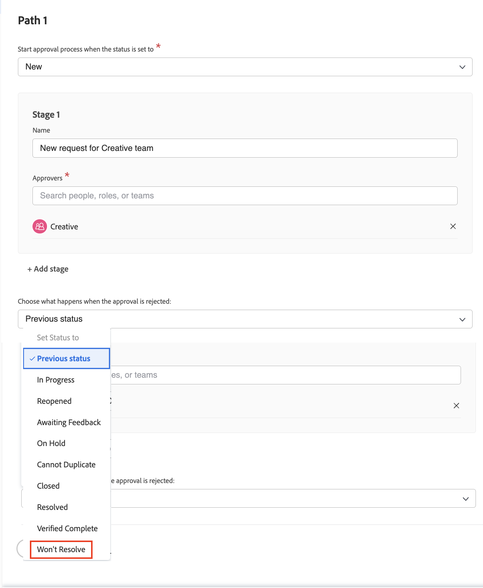

# Skapa en global godkännandeprocess och en godkännandeprocess för enstaka användning

Godkännandeprocesser för projekt, uppgifter och problem gör att en projektledare kan få expertbekräftelser på att arbetet har utförts precis innan man går vidare. Projektledaren kan skapa en godkännandeprocess för varje situation (detta kallas för en enstaka godkännandeprocess) eller välja från en lista med möjligen många godkännandeprocesser som tidigare har skapats för att tillgodose vanliga behov (dessa kallas globala eller befintliga godkännandeprocesser).

I båda fallen, när objektets status ändras till en som anges i godkännandeprocessen, meddelas godkännaren på olika sätt för att granska arbetet och godkänna eller avvisa det. Eftersom hela projektet kan pausas i väntan på godkännande bör godkännarna i förväg vara medvetna om att de kan anropas för godkännande. Om en godkännare inte är på kontoret av någon anledning kan de delegera sina godkännanden till en kvalificerad vikarie. Mer information finns i [Delegera uppgifter, utgåvor och godkännanden](/help/manage-work/approval-processes-and-milestone-paths/delegate-approvals.md).

I den här videon får du lära dig hur du skapar en global godkännandeprocess och en godkännandeprocess för ett projekt, en uppgift eller ett problem med en enstaka användning.

>[!VIDEO](https://video.tv.adobe.com/v/335225/?quality=12&learn=on)

>[!TIP]
>
>Du kan lägga till en enda godkännandeprocess för ett projekt eller en uppgift i en projektmall.

>[!NOTE]
>
>Du kan konfigurera ett enstaka godkännande av projekt och ärenden på samma sätt som beskrivs för uppgifter i videon.

## Använda automatiska utfärdandegodkännanden i en frågekö

Om du vill ställa in automatiska godkännanden av utgåvor i en begärandekö kan dessa bara göras med en global godkännandeprocess och tillämpas i ett [!UICONTROL köämne].

När du skapar eller redigerar ett [!UICONTROL köämne] väljer du den globala godkännandeprocessen i fältet **[!UICONTROL Standardgodkännande]**.

Du kan behöva redigera godkännandeprocessen för att se till att **[!UICONTROL Tidigare status]** inte är det som problemet ställs in på när godkännandet avvisas. Detta beror på att den tidigare statusen är **[!UICONTROL Ny]**, och det här är också den status som utlöser godkännandeprocessen, så det är den status som kommer att anges när den godkänns. För att undvika förvirring när godkännandet av ärendet avvisas är det bättre att ange statusen till något som **[!UICONTROL Kommer inte att matcha]**, eller till en anpassad status som skapats för detta.

## Rekommenderade självstudiekurser i detta ämne

* [Delegera uppgifter, ärenden och godkännanden](/help/manage-work/approval-processes-and-milestone-paths/delegate-approvals.md)
* [Förstå gruppspecifika godkännandeprocesser](/help/administration-and-setup/approval-processes-and-milestone-paths/group-specific-approval-processes.md)
* [Skapa ett begärandeflöde](/help/manage-work/request-queues/create-a-request-flow.md)

