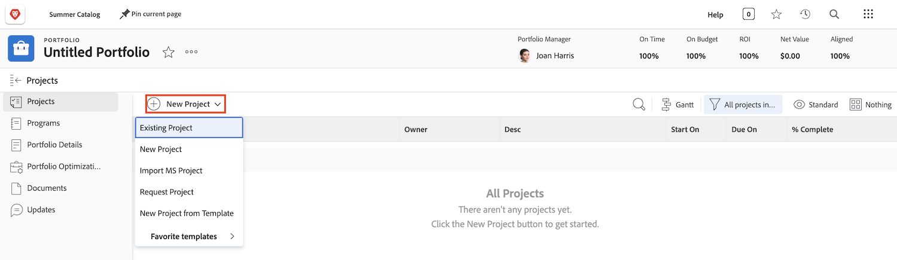
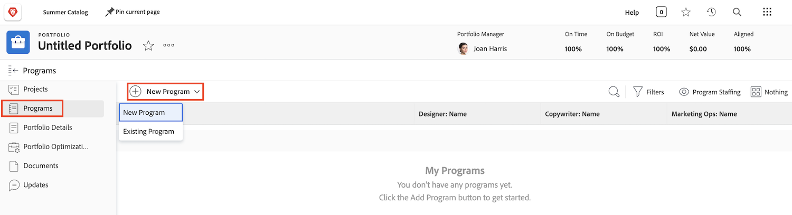

# Förstå portföljer

Cheferna har ofta det svåra arbetet med att ta reda på vilka projekt som bäst kan hjälpa deras företag att nå sina mål. Detta innebär att man måste bedöma ett aktuellt eller potentiellt projekt utifrån kriterier som är viktiga för dessa mål. Kriterierna kan omfatta t.ex. hur många resurser som behövs, hur mycket pengar projektet kommer att kosta jämfört med vad det kommer att medföra samt förståelse för riskerna. Med den här informationen kan cheferna bestämma vilka projekt som ska utföras och när.

Att tänka på och planera projekt är inte en särskilt svår uppgift - det är en process som de flesta chefer är vana vid. Den verkliga kampen består i att jämföra projekt med varandra. Att gå igenom en lång och detaljerad lista med projekt är tidskrävande. Där kan portföljer i Workfront hjälpa till.

## Vad är en portfölj?

En portfölj är en samling projekt som är fullständiga för samma resurser, budget, schema och prioritet. En marknadsföringsbyrå kan till exempel använda en portfölj för att gruppera alla projekt för en viss kund.

Navigera till avsnittet **[!UICONTROL Portfolio]** från [!UICONTROL huvudmenyn] och klicka sedan på ett portföljnamn för att öppna det.

Du kan använda knappen **[!UICONTROL Nytt projekt]** för att enkelt lägga till ett befintligt projekt i portföljen. Du kan också skapa ett nytt projekt direkt i portföljen.

![En bild av listrutan för knappen [!UICONTROL Nytt projekt]](assets/01-portfolio-management3.png)

När projekten har lagts till i portföljen kan du använda sammanfattningsinformationen i sidhuvudet för att få en högnivåvy över hur den här samlingen av projekt bidrar, antingen positivt eller negativt, till portföljens övergripande mål.

Du kan använda portföljoptimeringsverktyget (även [!UICONTROL Portfolio Optimizer]) för att prioritera projekt baserat på nettovärde, justering, kostnad, risk och avkastning.

## Åtkomst till portföljer

För att kunna arbeta med portföljer måste du ha tilldelats en planlicens i Workfront och en åtkomstnivå som ger dig behörighet att arbeta med portföljer.

När en portfölj skapas har bara portföljskaparen eller portföljförvaltaren tillgång till den. Du kan ge andra åtkomst till portföljen genom att dela den. Detta ger även tillgång till alla program och projekt i portföljen.

Öppna portföljen och klicka på menyn med tre punkter och välj sedan **[!UICONTROL Delning]**. Lägg till de personer, team, jobbroller, grupper eller företag som ska ha tillgång till dem. Bestäm sedan vilken typ av åtkomst de ska ha - hantera eller visa.

![En bild av alternativet [!UICONTROL Delning] i en [!DNL Workfront] portfölj ](assets/04-portfolio-management11.png)

## Skapa en portfölj

Om du vill skapa en portfölj klickar du på **[!UICONTROL Portfolio]** på huvudmenyn.

Klicka på **[!UICONTROL Nytt Portfolio]** i området Portfolio.

Namnge portföljen och klicka sedan på **[!UICONTROL Nytt projekt]** för att lägga till ett projekt i portföljen. Du kan skapa ett nytt projekt på flera olika sätt, precis som i området **[!UICONTROL Projekt]** . Alla nya projekt som du skapar härifrån hör till den här portföljen. Du kan också klicka på **[!UICONTROL Befintligt projekt]** om du vill välja befintliga projekt från en lista.

## Skapa ett program i en portfölj

Välj fliken **[!UICONTROL Program]** och klicka sedan på **[!UICONTROL Nytt program]** för att skapa ett nytt program i den här portföljen, eller klicka på **[!UICONTROL Befintligt program]** för att stjäla befintliga program från andra portföljer.

<!--
Pro-tips graphic
If a user can't access a specific portfolio, make sure it's shared with them. The Workfront access level determines that a user can access portfolios in general, but sharing makes sure they can see specific portfolios. 
-->

<!--
Learn more graphic and links to documentation articles
* Portfolio overview   
* Create a portfolio 
* Create and manage portfolios 
* Navigate within a portfolio 
* Share a portfolio   
-->
