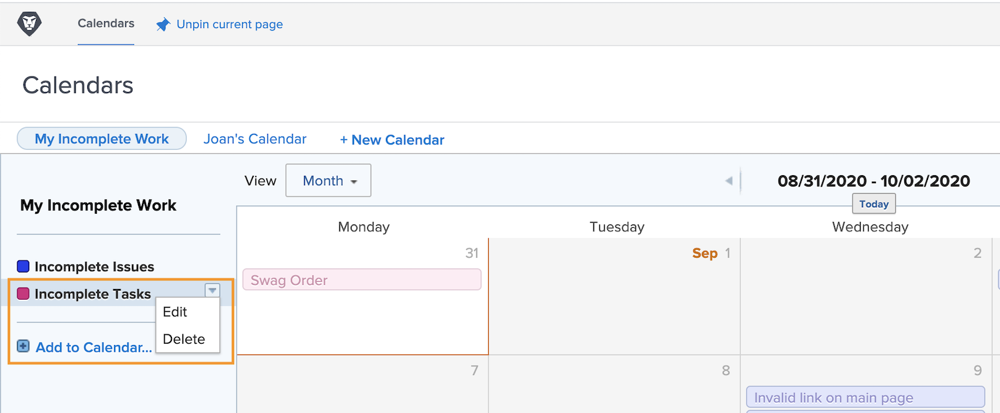

# Förstå ytterligare kalenderalternativ

I det här avsnittet får du lära dig att:

* Redigera en kalendergruppering
* Ta bort en kalendergrupp
* Dela en kalender

## Redigera en kalendergruppering

Om du vill redigera en gruppering håller du pekaren över namnet i kalendern. Klicka på nedpilen som visas till höger och välj **[!UICONTROL Redigera]**.

## Ta bort en kalendergrupp

Om du vill ta bort en gruppering håller du pekaren över namnet i kalendern. Klicka på nedpilen som visas till höger och välj **[!UICONTROL Ta bort]**.

## Dela en kalender

Som projektledare kan du skapa en kalender som du vill dela med andra, t.ex. projektledare, teammedlemmar osv.

1. Från **[!UICONTROL Huvudmeny]** väljer du en **[!UICONTROL Kalendrar]** område.
1. Välj den kalender som du vill dela.
1. Välj **[!UICONTROL Delning]** från **[!UICONTROL Kalenderåtgärder]** nedrullningsbar meny.
1. Ange namn på de användare, roller, team, grupper eller företag som du vill dela kalendern med.
1. Välj om användarna får [!UICONTROL Visa] eller [!UICONTROL Hantera] åtkomst till kalenderrapporten.
1. Klicka **[!UICONTROL Spara]**.

När du delar kalendrar finns det några saker att tänka på:

* Klicka på **[!UICONTROL kugghjulsikon]** i det övre högra hörnet av delningsfönstret för att göra kalendern synlig för hela systemet eller för att göra den offentlig för externa användare.
* [!UICONTROL Visa] åtkomst gör att användarna kan titta på kalendern men inte ändra filtren som styr grupperingarna.
* [!UICONTROL Hantera] ger användarna möjlighet att titta på kalendern och ändra filtren som styr grupperingarna.

## Delningsbar länk

Du kan dela en kalender med andra [!DNL Workfront] via en privat länk. Detta tar dem direkt till kalendern i [!DNL Workfront].

Du kan göra det här via **[!UICONTROL Kalenderåtgärder]** meny, genom att välja **[!UICONTROL Hämta delbar länk]**. Därifrån klickar du på **[!UICONTROL Kopiera länk]** och klistra in URL:en i ett e-postmeddelande eller snabbmeddelande med någon annan.

![En bild av en [!UICONTROL Hämta delbar länk] screen](assets/calendar-3-1.png)
