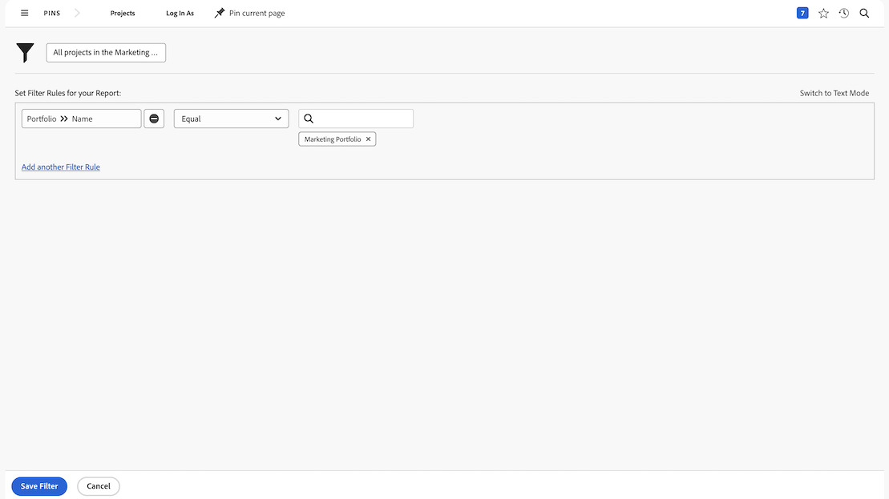
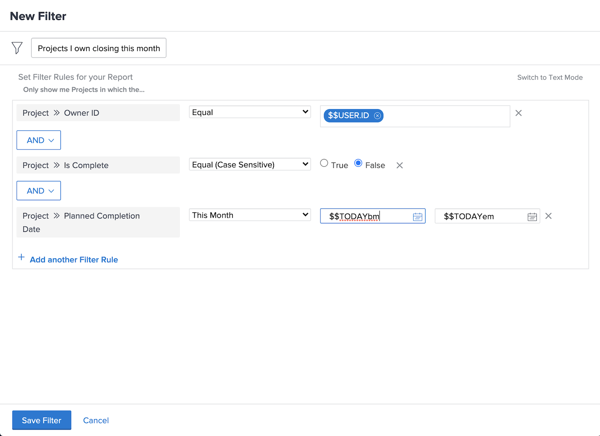

# Skapa grundläggande filteraktiviteter

## Aktivitet 1 - Alla projekt i marknadsföringsportföljen

I den här aktiviteten skapar du ett projektfilter med namnet&quot;Alla projekt i marknadsföringsportföljen&quot; i [!UICONTROL Äldre filter] upplevelse. Då visas alla projekt i portföljen med namnet&quot;Marketing Portfolio&quot;, oavsett status.

Stegvisa instruktioner finns nedan.

### Svar på aktivitet 1

1. Navigera till [!UICONTROL Projekt] området från [!UICONTROL Huvudmeny]. Här visas en lista med projekt.
1. Klicka på **[!UICONTROL Filter]** meny och välj [!UICONTROL Äldre filter].
1. Välj **[!UICONTROL Nytt filter]**.
1. Ge filtret namnet&quot;Alla projekt i marknadsföringsportföljen&quot;.
1. Klicka **[!UICONTROL Lägg till filterregel]**.
1. I [!UICONTROL Börja skriva fältnamn] fält, skriv &quot;[!UICONTROL portföljnamn]&quot;. Välj sedan [!UICONTROL Namn] under [!UICONTROL Portfolio] fältkälla.
1. Lämna [!UICONTROL Jämn] -operatorn som den är.
1. Skriv &quot;[!UICONTROL marknadsföring]&quot; i [!UICONTROL Börja skriva namn] fält.
1. Välj [!UICONTROL Marknadsföring Portfolio] Anta att du har en portfölj med det namnet som du vill filtrera på. Om du inte bara använder funktionen för att skriva framför för att hitta den portfölj du vill ha.
1. Klicka **[!UICONTROL Spara filter]**.

## Aktivitet 2 - projekt som jag äger stänger den här månaden

I den här videon skapar du ett projektfilter med namnet&quot;Projekt jag stänger den här månaden&quot; i [!UICONTROL Äldre filter] upplevelse. Om du håller ett öga på många projekt kan det här filtret hjälpa dig att zooma in på de som ska stängas snart.

Stegvisa instruktioner finns nedan.

>[!VIDEO](https://video.tv.adobe.com/v/336807/?quality=12&learn=on)

### Svar på aktivitet 2

1. Navigera till [!UICONTROL Projekt] området från [!UICONTROL Huvudmeny]. Här visas en lista med projekt.
1. Klicka på **[!UICONTROL Filter]** meny och välj [!UICONTROL Äldre filter].
1. Välj **[!UICONTROL Nytt filter]**.
1. Ge filtret namnet&quot;Projekt jag äger stänger den här månaden&quot;.
1. Klicka **[!UICONTROL Lägg till filterregel]**.
1. I [!UICONTROL Börja skriva fältnamn] fält, skriv &quot;owner&quot;. Välj sedan [!UICONTROL Ägar-ID] under [!UICONTROL Projekt] fältkälla.
1. Lämna [!UICONTROL Jämn] -operatorn som den är.
1. Skriv &quot;$$&quot; i dialogrutan [!UICONTROL Börja skriva namn] fält.
1. Välj [!UICONTROL $$USER.ID]. Detta är jokertecknet för den inloggade användaren.
1. Klicka [!UICONTROL Lägg till filterregel] igen.
1. I [!UICONTROL Börja skriva fältnamn] börjar du skriva&quot;Är slutförd&quot;. Välj sedan [!UICONTROL Är slutförd] under projektfältets källa.
1. Lämna [!UICONTROL Jämn] -operatorn som den är.
1. Välj &quot;Falskt&quot;.
1. Klicka [!UICONTROL Lägg till filterregel] igen.
1. I [!UICONTROL Börja skriva fältnamn] fälttypen&quot;planerad&quot;, välj sedan [!UICONTROL Planerat slutförandedatum] under [!UICONTROL Projekt] fältkälla.
1. Ändra [!UICONTROL Jämn] operator till [!UICONTROL Den här månaden].
1. Klicka **[!UICONTROL Spara filter]**.
