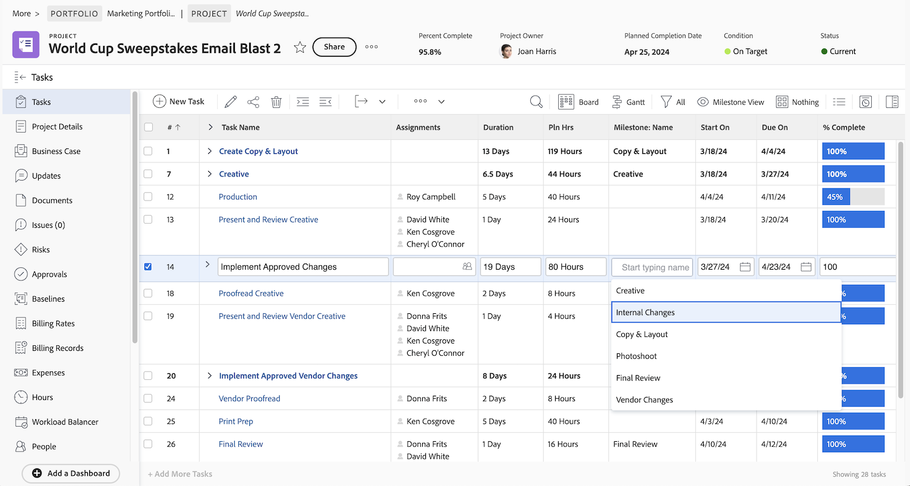

# Skapa en grundvy

I videon förklaras hur du skapar och anpassar vyer i Workfront för att visa specifik information om objekt i en lista, till exempel projekt, uppgifter, utgåvor och dokument. &#x200B; Med vyer kan användare visa information som namn, beskrivning, status och andra fält som är relevanta för objekten. &#x200B;

I videon betonas flexibiliteten i vyerna i Workfront och den innehåller stegvisa instruktioner för att skapa, anpassa och hantera dem.

>[!VIDEO](https://video.tv.adobe.com/v/3450242/?quality=12&learn=on&captions=swe)

## Viktiga uppgifter

* **Anpassa vyer**: Användare kan redigera befintliga vyer eller skapa nya genom att lägga till, ta bort eller ordna om kolumner för att visa specifik information, till exempel projektstatus eller budget.
* **Inline Editing**: Vissa fält i en listvy kan uppdateras direkt utan att enskilda objekt öppnas, vilket gör det snabbare att göra ändringar. &#x200B;
* **Skapa vyer från grunden**: Användare kan utforma vyer för att uppfylla specifika behov, som att spåra projekthälsa, genom att lägga till relevanta kolumner som budget, faktisk kostnad och status. &#x200B;
* **Vyer för delning och hantering**: Anpassade vyer kan delas med teammedlemmar för samarbete eller tas bort när de inte längre behövs.

## Aktiviteter för att skapa en grundvy

### Aktivitet 1: Skapa en aktivitetsstatusvy

Som projektledare, gruppledare eller resurshanterare vill du hålla reda på hur arbetet fortskrider. I den här vyn visas flera statusindikatorer för en aktivitet på en rad i listan eller rapporten.

Skapa en uppgiftsvy med namnet &quot;Aktivitetsstatusvy&quot; med följande kolumner:

* [!UICONTROL Aktivitetsnamn]
* [!UICONTROL Uppdrag]
* [!UICONTROL Varaktighet]
* [!UICONTROL Procent färdigt]
* [!UICONTROL Status]
* [!UICONTROL Förloppsstatus]
* [!UICONTROL Statusikoner]

### Svar 1

1. I en uppgiftslistrapport går du till listrutan **[!UICONTROL Visa]** och väljer **[!UICONTROL Ny vy]**.
1. Ge vyn namnet&quot;Aktivitetsstatusvy&quot;.
1. Ta bort de här kolumnerna: [!UICONTROL Planera timmar], [!UICONTROL Föregående], [!UICONTROL Starta den] och [!UICONTROL Förfaller den].
1. Klicka på **[!UICONTROL Lägg till kolumn]**.
1. I fältet [!UICONTROL Visa i den här kolumnen] skriver du&quot;status&quot; och väljer sedan&quot;Status&quot; under fältkällan [!UICONTROL Aktivitet].
1. Klicka på **[!UICONTROL Lägg till kolumn]** igen.
1. I fältet [!UICONTROL Visa i den här kolumnen] skriver du &quot;status&quot; och väljer sedan &quot;Status&quot; under fältkällan [!UICONTROL Aktivitet].
1. Klicka på **[!UICONTROL Lägg till kolumn]** igen.
1. I fältet [!UICONTROL Visa i den här kolumnen] skriver du &quot;status&quot; och väljer sedan &quot;Status Icons&quot; under aktivitetsfältets källa.
1. Klicka på **[!UICONTROL Spara]**.

Håll pekaren över ikonerna i kolumnen [!UICONTROL Statusikoner] för att se vad de representerar. Om de är nedtonade innebär det att uppgiften inte har några anteckningar, dokument, godkännandeprocesser osv. Om en ikon visas i färg är minst ett av objekten kopplat till uppgiften. Du kan klicka på antecknings- eller dokumentikonerna för att gå till det objektet.

### Aktivitet 2: Skapa en milstolpe-vy

Om du använder milstolpar är den här vyn det enklaste sättet att se milstolpar efter namn i uppgiftslistan och lägga till eller ta bort dem från en uppgift med hjälp av redigering i rad.

Skapa en uppgiftsvy med namnet&quot;Milstolpevy&quot; med följande kolumner:

* [!UICONTROL Aktivitetsnamn]
* [!UICONTROL Uppdrag]
* [!UICONTROL Varaktighet]
* [!UICONTROL Planera timmar]
* [!UICONTROL Milstolpe: Namn]
* [!UICONTROL Starta den]
* [!UICONTROL Förfaller den]
* [!UICONTROL Procent färdigt]

### Svar 2

1. Gå till listrutan **[!UICONTROL Visa]** i en projektuppgiftslista och välj **[!UICONTROL Ny vy]**.
1. Ge din vy namnet&quot;Milstolpevy&quot;.
1. Klicka på kolumnen [!UICONTROL Föregående] för att markera den.
1. I fältet [!UICONTROL Visa i den här kolumnen] klickar du på minusikonen i fältet [!UICONTROL Aktivitet >> Föregående], skriver [!UICONTROL milstolpe-namn] och klickar på [!UICONTROL Namn] i listan.
1. Klicka på **[!UICONTROL Spara]**.

### Aktivitet 3: Skapa en vy för varaktighetstyper och uppgiftsbegränsningar

I den här vyn kan du granska och redigera alla varaktighetstyper och aktivitetsbegränsningar i ditt projekt.

Skapa en uppgiftsvy med namnet&quot;Varaktighetstyper och vyn över uppgiftsbegränsningar&quot; med följande kolumner:

* [!UICONTROL Aktivitetsnamn]
* [!UICONTROL Uppdrag]
* [!UICONTROL Varaktighet]
* [!UICONTROL Planerad varaktighet]
* [!UICONTROL Planera timmar]
* [!UICONTROL Föregående]
* [!UICONTROL Starta den]
* [!UICONTROL Förfaller den]
* [!UICONTROL Varaktighetstyp]
* [!UICONTROL Aktivitetsbegränsning]
* [!UICONTROL Begränsningsdatum]

Ändra [!UICONTROL fältformatet &#x200B;] i kolumnerna [!UICONTROL Starta den] och [!UICONTROL Förfaller den &#x200B;] så att både datum och tid visas.

### Svar 3

1. Gå till listrutan **[!UICONTROL Visa]** i en projektuppgiftslista och välj **[!UICONTROL Ny vy]**.
1. Ge din vy namnet&quot;Varaktighetstyper och vyn Begränsade uppgifter&quot;.
1. Ta bort kolumnen [!UICONTROL &#x200B; % färdigt].
1. Klicka på **[!UICONTROL Lägg till kolumn]**.
1. I fältet [!UICONTROL Visa i den här kolumnen] skriver du [!UICONTROL &quot;duration&quot;] och väljer sedan [!UICONTROL &quot;Planerad varaktighet&quot;] under fältkällan [!UICONTROL Aktivitet].
1. Flytta den här kolumnen mellan kolumnerna [!UICONTROL Varaktighet] och [!UICONTROL Planera timmar].
1. Klicka på **[!UICONTROL Lägg till kolumn]** igen.
1. I fältet [!UICONTROL Visa i den här kolumnen] skriver du [!UICONTROL &quot;varaktighetstyp&quot;] och väljer sedan [!UICONTROL &quot;Varaktighetstyp&quot;] under fältkällan [!UICONTROL Aktivitet].
1. Klicka på **[!UICONTROL Lägg till kolumn]** igen.
1. I fältet [!UICONTROL Visa i den här kolumnen] skriver du [!UICONTROL &quot;begränsning&quot;] och väljer sedan [!UICONTROL &quot;Aktivitetsbegränsning&quot;] under aktivitetsfältets källa.
1. Klicka på **[!UICONTROL Lägg till kolumn]** igen.
1. I fältet [!UICONTROL Visa i den här kolumnen] skriver du [!UICONTROL &quot;begränsning&quot;] och väljer sedan [!UICONTROL &quot;Begränsningsdatum&quot;] under aktivitetsfältets källa.
1. Markera kolumnen [!UICONTROL Starta den] och klicka sedan på [!UICONTROL Avancerade alternativ].
1. Under listrutan [!UICONTROL Fältformat] väljer du [!UICONTROL &quot;10/17/60 3:00 AM&quot;].
1. Markera kolumnen [!UICONTROL Förfaller den] och klicka sedan på [!UICONTROL Avancerade alternativ].
1. Under listrutan [!UICONTROL Fältformat] väljer du [!UICONTROL &quot;10/17/60 3:00 AM&quot;].
1. Klicka på **[!UICONTROL Spara]**.

### Aktivitet 4: Skapa en aktiv statusvy för projektmall

Alla som hanterar projektmallar kommer att uppskatta om de kan se den aktiva statusen (Sant eller Falskt) för varje mall i en lista. Ännu bättre - fältet kan redigeras direkt!

Skapa en projektmallsvy med namnet&quot;Standard+active status&quot; med följande kolumner:

* [!UICONTROL Namn]
* [!UICONTROL Ägare]
* [!UICONTROL Varaktighet]
* [!UICONTROL Planerade timmar]
* [!UICONTROL Planerad kostnad]
* [!UICONTROL Flaggor]
* [!UICONTROL Gruppnamn]
* [!UICONTROL Är aktiv]

### Svar 4

1. Gå till listrutan **[!UICONTROL Visa]** i en projektmallslista och välj **[!UICONTROL Ny vy]**.
1. Ge vyn namnet&quot;Standard+active status&quot;.
1. Klicka på **[!UICONTROL Lägg till kolumn]**.
1. I fältet [!UICONTROL Visa i den här kolumnen] skriver du&quot;is&quot; och väljer&quot;Is Active&quot; under fältkällan [!UICONTROL Template].
1. Klicka på **[!UICONTROL Spara vy]**.
