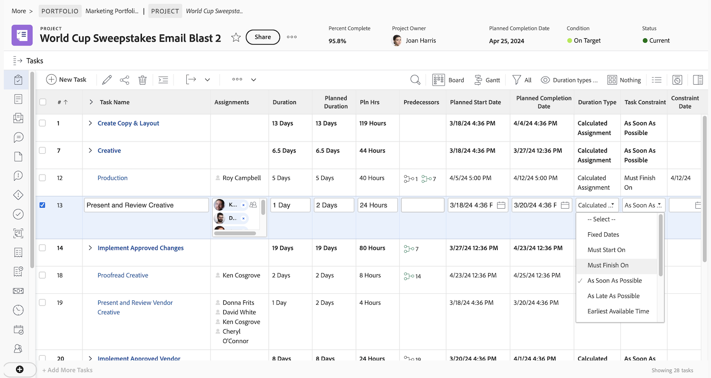

# Skapa en grundvy

I den här videon får du lära dig:

* Vilken vy har Workfront?
* Så här skapar och ändrar du en vy
* Dela en vy med andra Workfront-användare

>[!VIDEO](https://video.tv.adobe.com/v/335148/?quality=12&learn=on)

## Aktivitet 1: Skapa en aktivitetsstatusvy

Som projektledare, gruppledare eller resurshanterare vill du hålla reda på hur arbetet fortskrider. I den här vyn visas flera statusindikatorer för en aktivitet på en rad i listan eller rapporten.

Skapa en uppgiftsvy med namnet &quot;Aktivitetsstatusvy&quot; med följande kolumner:

* [!UICONTROL Aktivitetsnamn]
* [!UICONTROL Uppdrag]
* [!UICONTROL Varaktighet]
* [!UICONTROL Procent färdigt]
* [!UICONTROL Status]
* [!UICONTROL Status för förlopp]
* [!UICONTROL Statusikoner]

## Aktivitet 1 svar

1. Gå till **[!UICONTROL Visa]** nedrullningsbar meny och välj **[!UICONTROL Ny vy]**.
1. Ge vyn namnet&quot;Aktivitetsstatusvy&quot;.
1. Ta bort de här kolumnerna: [!UICONTROL Antal timmar], [!UICONTROL Föregående], [!UICONTROL Starta den]och [!UICONTROL Förfaller den].
1. Klicka **[!UICONTROL Lägg till kolumn]**.
1. I [!UICONTROL Visa i den här kolumnen] skriver du&quot;status&quot; och väljer sedan&quot;Status&quot; under [!UICONTROL Uppgift] fältkälla.
1. Klicka **[!UICONTROL Lägg till kolumn]** igen.
1. I [!UICONTROL Visa i den här kolumnen] skriver du&quot;status&quot; och väljer sedan&quot;Status&quot; under [!UICONTROL Uppgift] fältkälla.
1. Klicka **[!UICONTROL Lägg till kolumn]** igen.
1. I [!UICONTROL Visa i den här kolumnen] skriver du&quot;status&quot; och väljer sedan&quot;Status Icons&quot; under aktivitetsfältets källa.
1. Klicka **[!UICONTROL Spara]**.

Håll pekaren över var och en av ikonerna i dialogrutan [!UICONTROL Statusikoner] för att se vad de representerar. Om de är nedtonade innebär det att uppgiften inte har några anteckningar, dokument, godkännandeprocesser osv. Om en ikon visas i färg är minst ett av objekten kopplat till uppgiften. Du kan klicka på antecknings- eller dokumentikonerna för att gå till det objektet.

## Aktivitet 2: Skapa en milstolpevy

Om du använder milstolpar är den här vyn det enklaste sättet att se milstolpar efter namn och lägga till eller redigera dem med hjälp av redigering i rad.

Skapa en uppgiftsvy med namnet&quot;Milstolpevy&quot; med följande kolumner:

* [!UICONTROL Aktivitetsnamn]
* [!UICONTROL Uppdrag]
* [!UICONTROL Varaktighet]
* [!UICONTROL Antal timmar]
* [!UICONTROL Milstolpe: Namn]
* [!UICONTROL Starta den]
* [!UICONTROL Förfaller den]
* [!UICONTROL Procent färdigt]

## Aktivitet 2 svar

1. I en projektuppgiftslista går du till **[!UICONTROL Visa]** nedrullningsbar meny och välj **[!UICONTROL Ny vy]**.
1. Ge din vy namnet&quot;Milstolpevy&quot;.
1. Klicka på [!UICONTROL Föregående] för att markera den.
1. I [!UICONTROL Visa i den här kolumnen] klickar du på X-ikonen i [!UICONTROL Aktivitet >> Föregående] fält och skriv &quot;[!UICONTROL namn på milstolpe]&quot; och klicka på &quot;[!UICONTROL Namn]&quot; i listan.
1. Klicka **[!UICONTROL Spara]**.

## Aktivitet 3: Skapa en vy för varaktighetstyper och uppgiftsbegränsningar

I den här vyn kan du granska och redigera alla varaktighetstyper och aktivitetsbegränsningar i ditt projekt.

Skapa en uppgiftsvy med namnet&quot;Varaktighetstyper och vyn över uppgiftsbegränsningar&quot; med följande kolumner:

* [!UICONTROL Aktivitetsnamn]
* [!UICONTROL Uppdrag]
* [!UICONTROL Varaktighet]
* [!UICONTROL Planerad varaktighet]
* [!UICONTROL Antal timmar]
* [!UICONTROL Föregående]
* [!UICONTROL Starta den]
* [!UICONTROL Förfaller den]
* [!UICONTROL Typ av varaktighet]
* [!UICONTROL Aktivitetsbegränsning]
* [!UICONTROL Begränsningsdatum]

Ändra [!UICONTROL Fältformat] på [!UICONTROL Starta den] och [!UICONTROL Förfaller den] kolumner för att visa både datum och tid.

## Aktivitet 3 svar

1. I en projektuppgiftslista går du till **[!UICONTROL Visa]** nedrullningsbar meny och välj **[!UICONTROL Ny vy]**.
1. Ge din vy namnet&quot;Varaktighetstyper och vyn Begränsade uppgifter&quot;.
1. Ta bort [!UICONTROL % klart] kolumn.
1. Klicka **[!UICONTROL Lägg till kolumn]**.
1. I [!UICONTROL Visa i den här kolumnen] fält, typ [!UICONTROL &quot;duration&quot;] välj [!UICONTROL &quot;Planerad varaktighet&quot;] under [!UICONTROL Uppgift] fältkälla.
1. Flytta den här kolumnen mellan [!UICONTROL Varaktighet] och [!UICONTROL Antal timmar] kolumner.
1. Klicka **[!UICONTROL Lägg till kolumn]** igen.
1. I [!UICONTROL Visa i den här kolumnen] fält, typ [!UICONTROL &quot;duration type&quot;] välj [!UICONTROL &quot;Varaktighetstyp&quot;] under [!UICONTROL Uppgift] fältkälla.
1. Klicka **[!UICONTROL Lägg till kolumn]** igen.
1. I [!UICONTROL Visa i den här kolumnen] fält, typ [!UICONTROL &quot;constraint&quot;] välj [!UICONTROL &quot;Aktivitetsbegränsning&quot;] under aktivitetsfältets källa.
1. Klicka **[!UICONTROL Lägg till kolumn]** igen.
1. I [!UICONTROL Visa i den här kolumnen] fält, typ [!UICONTROL &quot;constraint&quot;] välj [!UICONTROL &quot;Begränsningsdatum&quot;] under aktivitetsfältets källa.
1. Välj [!UICONTROL Starta den] kolumn, klicka sedan på [!UICONTROL Avancerade alternativ].
1. Under [!UICONTROL Fältformat] nedrullningsbar markering [!UICONTROL &quot;10/17/60 03:00&quot;].
1. Välj [!UICONTROL Förfaller den] kolumn, klicka sedan på [!UICONTROL Avancerade alternativ].
1. Under [!UICONTROL Fältformat] nedrullningsbar markering [!UICONTROL &quot;10/17/60 03:00&quot;].
1. Klicka **[!UICONTROL Spara]**.
