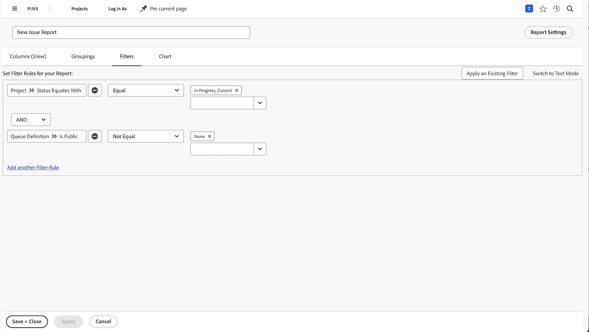

# Skapa en matrisrapport

I den här videon får du lära dig:

* När en matrisrapport kan användas
* Och hur du skapar en matrisrapport

>[!VIDEO](https://video.tv.adobe.com/v/335156/?quality=12&learn=on)

## Skapa matrisrapportaktiviteter

[Klicka här](/help/assets/create-matrix-report-activities.pdf) om du vill hämta en PDF av den här sidan.

### Aktivitet 1: Skapa en matrisrapport

Skapa en matrisrapport som visar hur många begäranden som finns i varje status, sorterade efter begärandekö. Det här ger dig en snabb överblick över mängden arbete som kommer in och hur väl du håller jämna steg med det.

Du vill att begärandeköerna ska visas i radgrupperingarna. Status visas som kolumngrupperingar. Ge rapporten namnet&quot;Begäranden per status och begärandekö&quot;.

### Svar 1

1. Välj **[!UICONTROL Rapporter]** på **[!UICONTROL Huvudmenyn]**.
1. Klicka på alternativet **[!UICONTROL Ny rapport]** och välj **[!UICONTROL Problem]**.
1. Gå till fliken **[!UICONTROL Grupperingar]** och klicka på **[!UICONTROL Växla till matrisgruppering]**.
1. För [!UICONTROL radgrupperingar] väljer du **[!UICONTROL Projekt]** > **[!UICONTROL Namn]**.
1. För [!UICONTROL Kolumngruppering] väljer du **[!UICONTROL Problem]** > **[!UICONTROL Status]**.

   

1. Gå till fliken **[!UICONTROL Filter]**.
1. Om du vill vara säker på att bara begäranden visas i aktiva begärandeköer lägger du till följande filterregler:

   * [!UICONTROL Projekt] > [!UICONTROL Status motsvarar med] > [!UICONTROL Lika med] > [!UICONTROL Aktuell]
   * [!UICONTROL Ködefinition] > [!UICONTROL Är offentlig] > [!UICONTROL Inte lika med] > [!UICONTROL Ingen] (så vet vi att ett projekt egentligen är en begärandekö, eftersom ködefinitionen tilldelas till ett av de offentliga alternativen.)

1. Klicka på **[!UICONTROL Spara + stäng]**. När du uppmanas att ange ett rapportnamn skriver du&quot;Begäranden efter status och Begärandekö&quot;.

   
