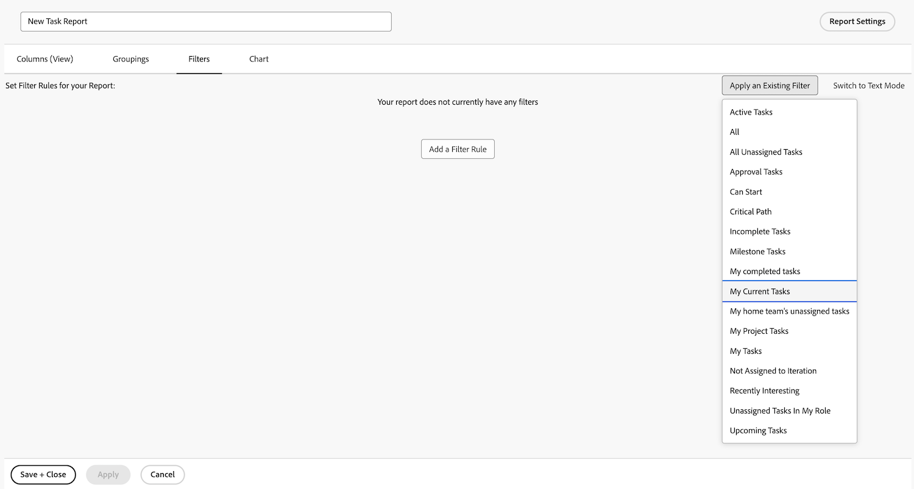

# Skapa en enkel rapport

I den här videon får du lära dig att:

* Skapa en enkel rapport med ett befintligt filter, en befintlig vy och en befintlig gruppering

>[!VIDEO](https://video.tv.adobe.com/v/335153/?quality=12&learn=on)

## Skapa enkla rapportaktiviteter

[Klicka här](/help/assets/create-simple-report-activities.pdf) om du vill hämta en PDF av den här sidan.

### Aktivitet 1: Skapa en enkel uppgiftsrapport

Du vill spåra alla dina aktiva uppgifter i en enda rapport. Skapa en aktivitetsrapport med namnet&quot;Mina aktuella uppgifter&quot; med följande:

* Kolumner (vy) = Standard
* Grupperingar = Projekt
* Filter = Mina aktuella uppgifter
* Beskrivning = Oavslutade uppgifter i aktuella projekt där jag är aktivitetsägaren, grupperade efter projekt.

### Svar 1

1. Gå till **[!UICONTROL huvudmenyn]** och välj **[!UICONTROL Rapporter]**.
1. Klicka på listrutan **[!UICONTROL Ny rapport]** och välj **[!UICONTROL Aktivitetsrapport]**.
1. I [!UICONTROL Kolumner (Visa)] klickar du på menyn **[!UICONTROL Använd befintlig vy]** och väljer **[!UICONTROL Standard]**.

   

1. Klicka på menyn **[!UICONTROL Använd en befintlig gruppering]** på fliken **[!UICONTROL Grupperingar]** och välj **[!UICONTROL Projekt]**.

   

1. Klicka på menyn **[!UICONTROL Använd ett befintligt filter]** på fliken **[!UICONTROL Filter]** och välj Mina aktuella uppgifter.

   

1. Öppna **[!UICONTROL Rapportinställningar]** och ge rapporten namnet&quot;Mina aktuella uppgifter&quot;.
1. I fältet Beskrivning anger du &quot;Ofullständig
uppgifter i Aktuella projekt där jag är uppgiften
ägare, grupperad efter projekt.&quot;

   

1. Spara och stäng rapporten.
