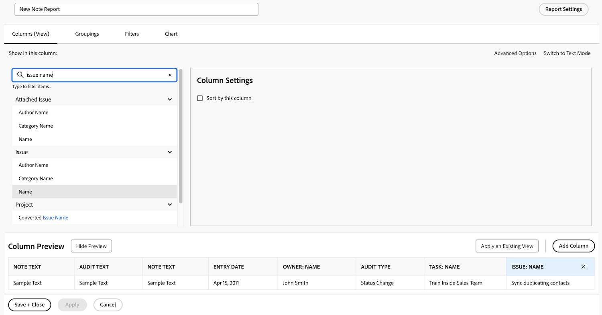
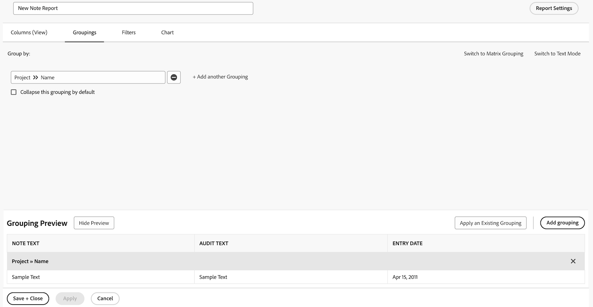
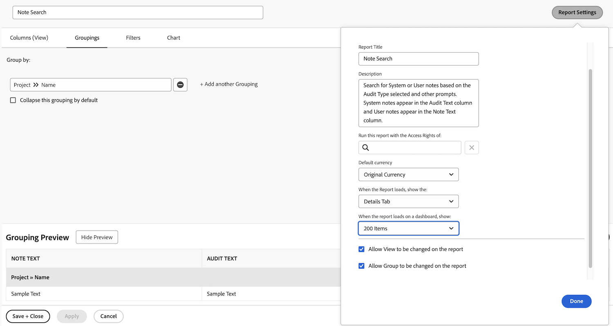
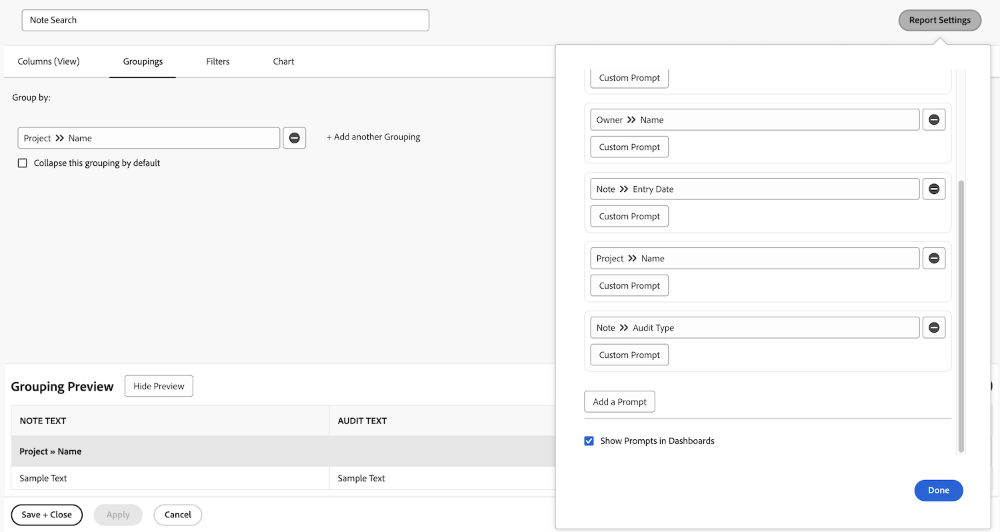
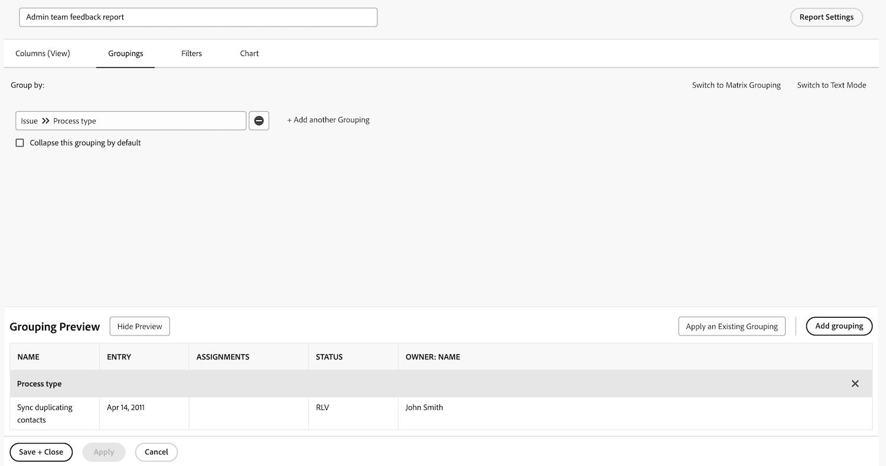

# Skapa en ny aktivitetsrapport

I videon finns en stegvis guide om hur du skapar en anpassad rapport för att spåra sena uppgifter som tilldelats den inloggade användaren. Det börjar med att förklara behovet av anpassade rapporter när befintliga filter, vyer eller inbyggda rapporter inte uppfyller specifika krav. &#x200B; Rapporten heter&quot;Sena uppgifter som jag tilldelats&quot; med en beskrivning tillagd för tydlighet. &#x200B;

Den resulterande rapporten hjälper användarna att fokusera på sena uppgifter, ger insikter om beroenden och förenklar navigeringen till värdprojekten. &#x200B;

>[!VIDEO](https://video.tv.adobe.com/v/3448346/?captions=swe&quality=12&learn=on&enablevpops=0)

## Viktiga uppgifter

* **Skapa anpassade rapporter:** Om befintliga filter och inbyggda rapporter inte uppfyller dina behov kan du skapa en anpassad rapport från början för att fokusera på specifika data, till exempel sena aktiviteter som du har tilldelats. &#x200B;
* **Filterinställningar:** Använd filter för att definiera rapportvillkor, inklusive sena uppgifter, ofullständiga uppgifter, aktuella projekt och uppgifter som tilldelats den inloggade användaren. &#x200B;
* **Kolumner för kontext:** Lägg till kolumner som &quot;Kan starta&quot; för att identifiera beroendeproblem och &quot;Projektnamn&quot; med hyperlänkar för enkel navigering till relaterade projekt. &#x200B;
* **Sortering efter prioritet:** Sortera uppgifter efter kolumnen &quot;Förfaller den&quot; i stigande ordning för att prioritera de mest försenade uppgifterna högst upp i rapporten. &#x200B;
* **Tillgänglighet:** Spara rapporten, fäst den eller markera den som en favorit för snabb åtkomst, vilket ger effektiv spårning och hantering av sena uppgifter.

## Aktiviteter som&quot;Skapa en uppgiftsrapport&quot;

>[!TIP]
>
>Dela upp dina spatulor och mixa skålar och gör dig redo att prova recepten i vår [Adobe Workfront Customer Reporting Cookbook](/help/assets/workfront-customer-reporting-cookbook.pdf). Inuti finns stegvisa instruktioner för 10 rapporter, klara att användas i din miljö idag.
>Vi har samlat in rapporter från kunderna och sammanställt dem i en lättsmält kokbok som du kan ta tillbaka och testa i ditt eget Workfront-kök.
>Dessa 10 rapporter kommer från kunder som är precis som du. Vi är skyldiga ett stort tack till de fantastiska kunder som delade en av sina favoritrapporter, som sprids ut över olika branscher, avdelningar, team, befattningar och alla i olika företag. Vissa rapporter är enkla (men mycket användbara), och vissa är mer komplexa för att ta dina rapporter till nästa nivå.

### Aktivitet 1: Skapa en anteckningsrapport med uppmaningar

Skapa en anteckningsrapport som du kan använda för att söka efter användaranteckningar (d.v.s. kommentarer eller uppdateringar) eller systemanteckningar baserat på anteckningsinnehållet, författaren, anmälningsdatumet, projektnamnet eller granskningstypen. Ge rapporten namnet&quot;Anteckningssökning&quot;.

När du använder kommandotolken Anteckningstext söker den här rapporten i uppdateringstrådar för att snabbt extrahera alla som uppfyller villkoren som anges i uppmaningarna. När du kör rapporten behöver du inte fylla i varenda dialogruta, bara de som du bryr dig om. De tomma ignoreras automatiskt.

Vyn ska innehålla kolumner för:

* Anteckningstext
* Granskningstext
* Anmälningsdatum
* Ägare: Namn
* Granskningstyp
* Aktivitetsnamn
* Ärendenamn

Lämna filterfliken tom.

Gruppera efter projektnamn.

Ta med uppmaningar om följande:

* Granskningstext
* Anteckningstext
* Ägarnamn
* Anmälningsdatum
* Projektnamn
* Granskningstyp

### Svar 1

1. Välj **[!UICONTROL Rapporter]** på **[!UICONTROL Huvudmenyn]**.
1. Klicka på menyn **[!UICONTROL Ny rapport]** och välj **[!UICONTROL Obs!]**.
1. I **[!UICONTROL Kolumner (Visa)]** ställer du in dina kolumner så att de omfattar:

   

   * [!UICONTROL Obs!] > [!UICONTROL Anteckningstext]
   * [!UICONTROL Obs!] > [!UICONTROL Granska text]
   * [!UICONTROL Obs!] > [!UICONTROL Anmälningsdatum]
   * [!UICONTROL Ägare] > [!UICONTROL Namn]
   * [!UICONTROL Obs!] > [!UICONTROL Granskningstyp]
   * [!UICONTROL Aktivitet] > [!UICONTROL Namn]
   * [!UICONTROL Problem] > [!UICONTROL Namn]

1. Markera kolumnen **[!UICONTROL Postdatum]** och ändra **[!UICONTROL Sortera till fallande]**.
1. På fliken **[!UICONTROL Grupperingar]** anger du att rapporten ska grupperas efter [!UICONTROL Projekt] > [!UICONTROL Namn].

   

1. Lämna [!UICONTROL Filter] tomt.
1. Öppna **[!UICONTROL Rapportinställningar]** och ge rapporten namnet&quot;Anteckningssökning&quot;.
1. I fältet [!UICONTROL Beskrivning] skriver du något som: Sök efter system- eller användaranteckningar baserat på granskningstypen och andra uppmaningar. Systemanteckningar visas i kolumnen Granskningstext och Användaranteckningar visas i kolumnen Anteckningstext.&quot;

   

1. Välj fliken **[!UICONTROL Information]** så att den visas när rapporten läses in.
1. Ange att rapporten ska visa 200 objekt när rapporten inkluderas på en kontrollpanel.
1. Klicka på **[!UICONTROL Rapportera frågor]** och lägg till:

   

   * [!UICONTROL Obs!] > [!UICONTROL Granska text]
   * [!UICONTROL Obs!] > [!UICONTROL Anteckningstext]
   * [!UICONTROL Ägare] > [!UICONTROL Namn]
   * [!UICONTROL Obs!] > [!UICONTROL Anmälningsdatum]
   * [!UICONTROL Projekt] > [!UICONTROL Namn]
   * [!UICONTROL Obs!] > [!UICONTROL Granskningstyp]

1. Markera kryssrutan för **[!UICONTROL Visa frågor i instrumentpaneler]**.
1. Spara och stäng rapporten.

### Aktivitet 2: Skapa en feedback från administratörsteamet

Det här är en problemrapport som visar alla problem i en kön för feedback-begäranden som har skapats för systemadministratörer. Du kan se hur du skapar den här begärandekön i självstudiekursen [Skapa en kö för systemadministratörsfeedback](https://experienceleague.adobe.com/docs/workfront-learn/tutorials-workfront/manage-work/request-queues/create-a-system-admin-feedback-request-queue.html?lang=sv-SE).

I den här rapporten används även ett anpassat formulär. Om du vill lära dig hur du skapar ett anpassat formulär kan du läsa självstudiekursen [Skapa och dela ett anpassat formulär](https://experienceleague.adobe.com/docs/workfront-learn/tutorials-workfront/custom-data/custom-forms/custom-forms-creating-and-sharing-a-custom-form.html?lang=sv-SE).

Det anpassade formuläret ska ha objekttyperna Project och Issue och ska skapas enligt följande:

Namn: Administratörsprocessfeedback

1. Processtyp (listruta med ett val)
   * åtkomstnivåer
   * godkännandeprocess (endast globalt)
   * e-postmeddelanden
   * layoutmall
   * milstolpbana
   * projektmall
   * påminnelsemeddelanden
   * begärandekö
1. Processnamn (textfält med en rad)
1. Processkvalitet (listruta med ett val)
   * 1 - helt värdelös
   * 2 - inte särskilt användbar
   * 3 - bra men kunde vara bättre
   * 4 - utmärkt
1. Problem eller goda nyheter (textfält för stycke)

Skapa en problemrapport med namnet **Administratörsteamets feedback-rapport**.

Vyn ska ha följande kolumner:

* Problem: Namn
* Primär kontakt: Namn
* Problem: Processtyp
* Problem: Processnamn
* Problem: Processkvalitet
* Problem: Problem eller goda nyheter
* Utgåva: Anmälningsdatum
* Problem: Ålder
* Problem: Uppdrag
* Problem: Status

Grupp på processtyp.

Filtrera på ID:t för begärandeköprojektet där feedbackproblemen finns.

### Svar 2

1. Välj **[!UICONTROL Rapporter]** på **[!UICONTROL Huvudmenyn]**.
1. Klicka på menyn **[!UICONTROL Ny rapport]** och välj **[!UICONTROL Problem]**.
1. I **[!UICONTROL Kolumner (Visa)]** ställer du in dina kolumner så att de omfattar:

   

   * [!UICONTROL Problem] > [!UICONTROL Namn]
   * [!UICONTROL Primär kontakt] > [!UICONTROL Namn]
      * Obs! Detta visas med &quot;Ägare:Name&quot; som kolumnetikett. Du kan ändra detta till&quot;Rapporterad av&quot; genom att klicka på Avancerade alternativ och skriva&quot;Rapporterad av&quot; i fältet **Etikett för anpassad kolumn**.
   * [!UICONTROL Problem] > [!UICONTROL Processtyp]
   * [!UICONTROL Problem] > [!UICONTROL Processnamn]
   * [!UICONTROL Problem] > [!UICONTROL Processgrad]
   * [!UICONTROL Problem] > [!UICONTROL Problem eller goda nyheter]
   * [!UICONTROL Utgåva] > [!UICONTROL Införseldatum]
   * [!UICONTROL Problem] > [!UICONTROL Ålder]
   * [!UICONTROL Problem] > [!UICONTROL Uppdrag]
   * [!UICONTROL Problem] > [!UICONTROL Status]

1. Markera kolumnen **[!UICONTROL Postdatum]** och ändra **[!UICONTROL Sortera till fallande]**.
1. På fliken **[!UICONTROL Grupperingar]** ställer du in rapporten på att gruppera efter **[!UICONTROL Problem] > [!UICONTROL Processtyp]**.

   

1. På fliken **[!UICONTROL Filter]** lägger du till ett filter för **[!UICONTROL Utgåva] > [!UICONTROL Projekt-ID]** som är lika med begärandeköprojektet där feedbackproblemen finns.

   

1. Spara och stäng rapporten.
