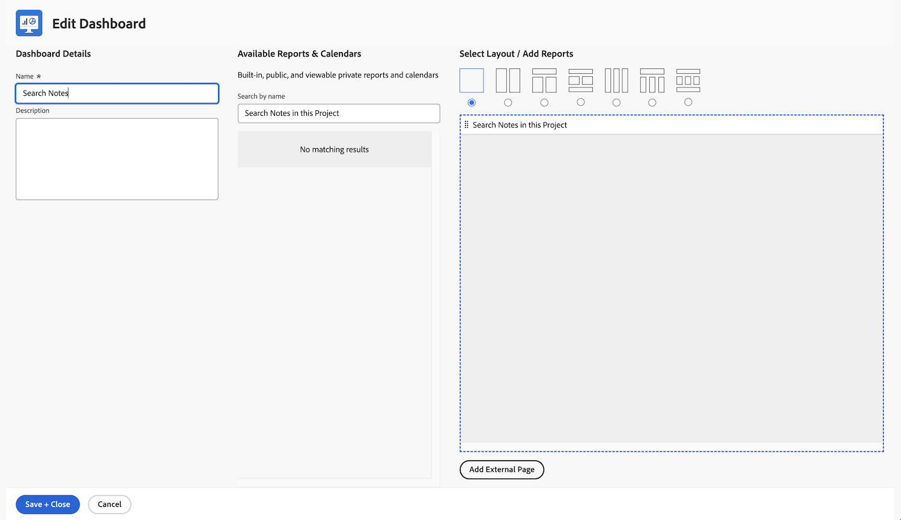
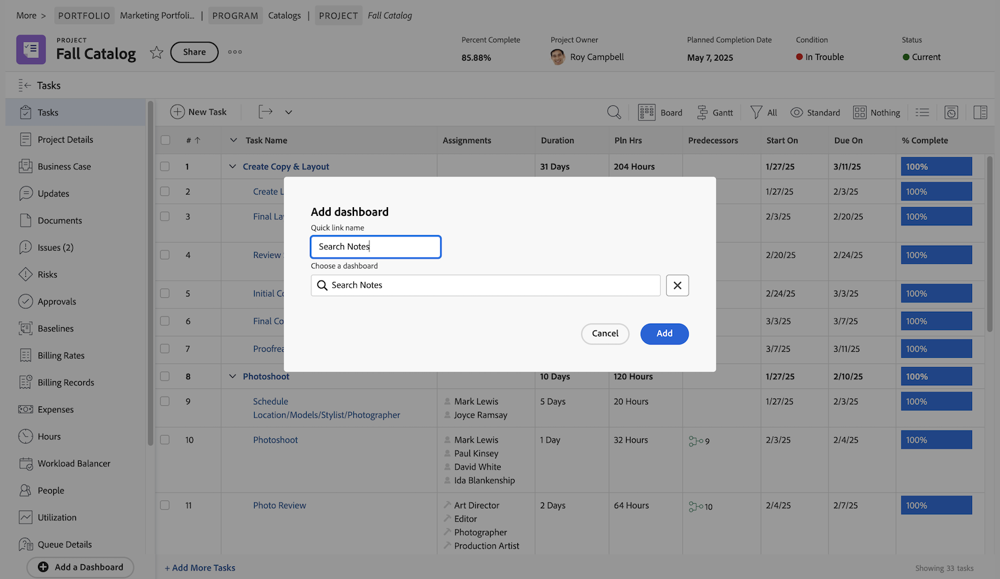

# Skapa instrumentpaneler

I den här videon får du lära dig:

* Vad en kontrollpanel är i Workfront
* Så här skapar du en kontrollpanel
* Hitta och använda kontrollpaneler
* Dela en kontrollpanel med andra Workfront-användare
* Skriva ut en kontrollpanel

>[!VIDEO](https://video.tv.adobe.com/v/335157/?quality=12)

## Aktivitet: Skapa en instrumentpanel

Skapa en [!UICONTROL kontrollpanel] med bara en rapport i den -&quot;Sök anteckningar i det här projektet&quot;. Detta är användbart om du snabbt vill hitta uppdateringar som gjorts i ett projekt, även om det finns tusentals uppdateringar att söka igenom. Detta söker efter uppdateringstrådar för att snabbt extrahera uppdateringar som uppfyller villkoren som du anger i uppmaningarna.

Skapa den här rapporten genom att skapa en kopia av rapporten&quot;Anteckningar&quot; som du skapade i aktiviteten&quot;Skapa en anteckningsrapport&quot; (eller använd en annan rapport om du inte gjorde den aktiviteten).

* Ta bort uppmaningen om projektnamn från kopian och byt namn på rapporten&quot;Sök anteckningar i det här projektet&quot;.
* Namnge [!UICONTROL Kontrollpanel] &quot;Sök anteckningar.&quot;
* Gå till valfri projektstartsida och skapa en anpassad sektion för en [!UICONTROL kontrollpanel].
* Observera, att när du söker efter anteckningar i ditt anpassade avsnitt visas endast anteckningar i det projekt du just nu befinner dig i.

## Svar

1. Kör rapporten som du skapade i aktiviteten Skapa en anteckningsrapport.
1. Klicka **[!UICONTROL Rapportåtgärder]** och markera **[!UICONTROL Kopiera]**. [!DNL Workfront] skapar en ny rapport med namnet&quot;Anteckningssökning (kopia)&quot;.
1. Gå till **[!UICONTROL Rapportåtgärder]** och markera **[!UICONTROL Redigera]**. Klicka **[!UICONTROL Rapportinställningar]** och ändra namnet till &quot;Sök anteckningar i det här projektet&quot;.
1. Klicka [!UICONTROL Rapportera uppmaningar] och ta bort [!UICONTROL Projekt] > [!UICONTROL Namn] i listan.

   

1. Kontrollera **[!UICONTROL Visa uppmaningar i instrumentpanelen]** box.
1. Klicka **[!UICONTROL Klar]** sedan **[!UICONTROL Spara + Stäng]**. Du tittar nu på [!UICONTROL Uppmaningar] rapportens skärm.

   Därefter ska du använda en genväg för att skapa en ny instrumentpanel och lägga till den här rapporten i den.

1. Klicka **[!UICONTROL Rapportåtgärder]** och markera **[!UICONTROL Lägg till på instrumentpanelen]** > **[!UICONTROL Ny instrumentpanel]**.
1. Dra rapporten &quot;Search Notes in This Project&quot; till **[!UICONTROL Layout]** -panelen.
1. Observera att rapportens namn blir kontrollpanelens namn. Redigera namnet så att det bara är &quot;Sök anteckningar&quot;.

   

1. Klicka **[!UICONTROL Spara + Stäng]**.

   Lägg nu till kontrollpanelen på en projektsida.

   

1. Gå till vilket projekt som helst. Klicka på **[!UICONTROL Lägg till anpassat avsnitt]** ikon.
1. I **[!UICONTROL Lägg till en instrumentpanel]** skriver du&quot;Search Notes&quot; och väljer [!UICONTROL kontrollpanel] från listan.
1. I **[!UICONTROL Anpassad avsnittsrubrik]** -fält, skriv i &quot;Sökanteckningar&quot;.
1. Klicka **[!UICONTROL Lägg till nytt avsnitt]**.
1. På den vänstra panelmenyn hittar du Sök anteckningar. Klicka på punkterna till vänster om avsnittsnamnet och dra det till höger under Uppdateringar.
