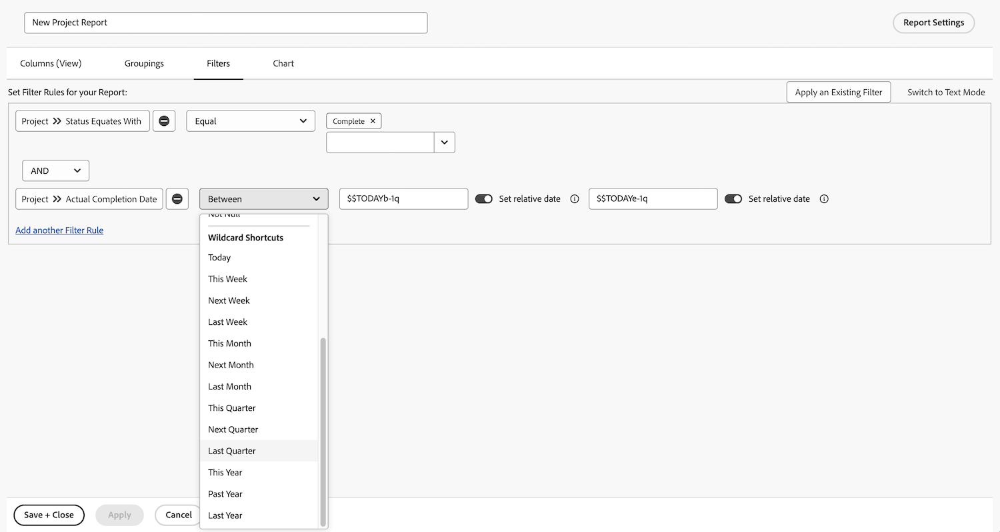

# Skapa rapporter med diagram

I den här videon får du lära dig:

* Hur diagram kan förbättra visualiseringen av data
* Så här använder du Workfront diagramverktyg

>[!VIDEO](https://video.tv.adobe.com/v/335155/?quality=12&learn=on)

## Aktivitet: Lägga till ett diagram i en rapport

Slutet av kvartalet närmar sig och du vill se hur nyligen slutförda projekt fastnade i budgeten. Skapa en rapport som visar de planerade kostnaderna kontra den faktiska kostnaden för projekt. Du vill bara visa projekt som har slutförts under det senaste kvartalet. Lägg till ett kombinationsdiagram med anpassade färger.

## Svar

1. Välj **[!UICONTROL Rapporter]** från **[!UICONTROL Huvudmeny]**.
1. Klicka på **[!UICONTROL Ny rapport]** meny och välj **[!UICONTROL Projekt]**.
1. I **[!UICONTROL Kolumner (vy)]** flik, klicka **[!UICONTROL Lägg till kolumn]**.
1. Välj [!UICONTROL Projekt] > [!UICONTROL Planerad kostnad] och sammanfatta den här kolumnen med **[!UICONTROL Summa]**.
1. Klicka **[!UICONTROL Lägg till kolumn]** igen.
1. Välj [!UICONTROL Projekt] > [!UICONTROL Faktisk kostnad] och sammanfatta den här kolumnen med **[!UICONTROL Summa]**.

   

1. I **[!UICONTROL Grupperingar]** ställer du in rapporten på att gruppera efter [!UICONTROL Projekt] > [!UICONTROL Namn].

   

1. I **[!UICONTROL Filter]** lägger du till två filterregler:

   * [!UICONTROL Projekt] > [!UICONTROL Status är lika med] > [!UICONTROL Slutförd]
   * [!UICONTROL Projekt] >[!UICONTROL  Faktiskt slutförandedatum] > [!UICONTROL Sista kvartalet]

   

1. I **[!UICONTROL Diagram]** flik, välja **[!UICONTROL Kolumn]** för diagramtypen.
1. För [!UICONTROL Vänster (Y) axel], välja [!UICONTROL Projekt] > [!UICONTROL Planerad kostnad].
1. För [!UICONTROL Nedre (X) axel], välja [!UICONTROL Projekt] > [!UICONTROL Namn].
1. Klicka på **[!UICONTROL Kombinationsdiagram]** och markera [!UICONTROL Projekt] > [!UICONTROL Faktisk kostnad] i **[!UICONTROL Värde]** fält.
1. Klicka på pilen bredvid färgrutan för att ändra [!UICONTROL Faktisk kostnad] färg. Välj en av färgerna som visas eller klicka på rutan i det nedre högra hörnet för att visa färgpaletten.
1. Klicka på **[!UICONTROL Spara + Stäng]**. När du uppmanas att ange ett rapportnamn kallar du det&quot;Planerad kontra faktisk kostnad per projekt slutfört förra kvartalet&quot;.

   
