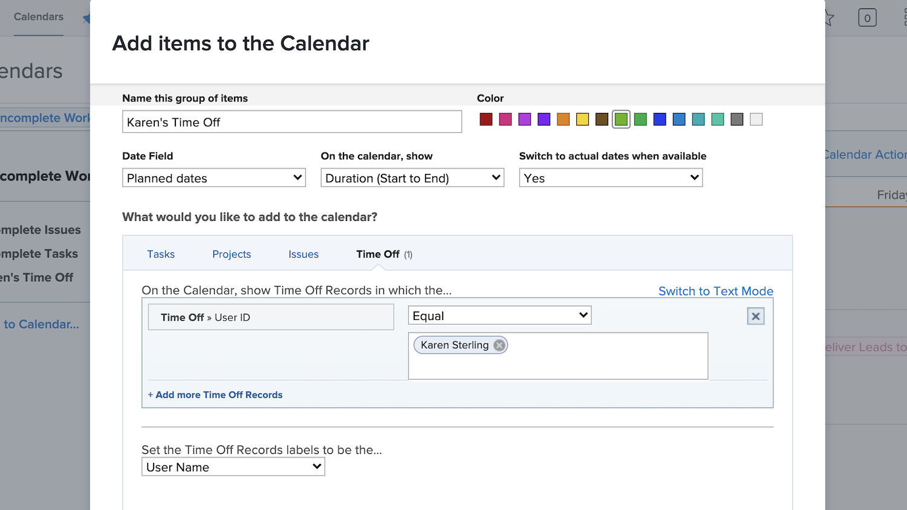

# Skapa en anpassad kalender

I det här avsnittet får du lära dig att:

* Skapa en ny kalender
* Skapa en kalendergruppering
* Lägg till arbetsobjekt i kalendergruppen
* Skapa en tid utan kalender

Så här skapar du en egen kalender.

## Lägg först till en ny kalender

1. Från **[!UICONTROL Huvudmeny]** väljer du **[!UICONTROL Kalendrar]** område.
1. Klicka på **[!UICONTROL Ny kalender]** alternativ.
1. Skriv ett namn för kalendern och tryck på **[!UICONTROL Retur]**.

## Lägg sedan till en kalendergruppering

1. Om du vill visa objekt som hör till ett visst projekt anger du projektnamnet i [!UICONTROL gruppera] -fält (här visas alla aktiviteter som är relaterade till det projektet).
1. Eller klicka på **[!UICONTROL Lägg till avancerade objekt]** om du vill inkludera arbetsobjekt från flera olika projekt i systemet.

## För det tredje lägger du till arbetsobjekt i kalendergruppen

1. Ge grupperingen ett namn som återspeglar vad som kommer att visas.
1. Välj en färgbeteckning för gruppen.
1. Välj vilken datumtyp som ska användas—[!UICONTROL Planerade datum], [!UICONTROL Planerade datum], eller [!UICONTROL Egen]. ([!UICONTROL Egen] datum är datumfält inkluderade på [!UICONTROL anpassade formulär].)
1. Välj vilka datum som ska visas i kalendern -[!UICONTROL Endast slutdatum], [!UICONTROL Endast startdatum], eller [!UICONTROL Varaktighet (från början till slut)].
1. Om du vill visa [!UICONTROL Faktiska datum] När den informationen är tillgänglig väljer du Ja på menyn. Välj Nej om du alltid vill ha den markerade datumtypen ([!UICONTROL Projicerat], [!UICONTROL Planerad], eller [!UICONTROL Egen]) som ska visas.
1. Välj vilken typ av objektinformation du vill se i kalendern—[!UICONTROL Uppgifter], [!UICONTROL Projekt], [!UICONTROL Problem], eller [!UICONTROL Tid av].
1. Ställ in filtren för att visa önskad information.
1. Klicka **[!UICONTROL Spara]**.

>[!NOTE]
>
>Ytterligare grupperingar kan läggas till i en befintlig kalender med alternativet Lägg till i kalender.

## Skapa en kalender som visar ledig tid

[!DNL Workfront] ger dig ett sätt att ange din ledig tid med den personliga ledig tiden i din användarprofil. Detta varnar projektledarna om att du inte är tillgänglig och tillåter att planerade slutförandedatum justeras automatiskt eller manuellt efter behov.

I området Kalender kan du skapa en kalendervy som visar dessa lediga poster.

Så här skapar du en kalender för en viss person:

1. Klicka **[!UICONTROL Lägg till i kalendern]** i den vänstra panelen.
1. Klicka **[!UICONTROL Lägg till avancerade objekt]**.
1. Ge grupperingen ett namn som återspeglar vad som kommer att visas.
1. Välj en färgbeteckning för grupperingen.
1. Ange [!UICONTROL Datumfält] till [!UICONTROL Planerade datum].
1. Välj vilka datum som ska visas i kalendern -[!UICONTROL Varaktighet].
1. Ignorera hur informationen visas om faktiska datum inte är tillgängliga. Detta gäller inte.
1. Välj [!UICONTROL Tid av] för den typ av information som du vill se.
1. För filtret anger du användar-ID till teammedlemmens namn.
1. Klicka **[!UICONTROL Spara]**.

