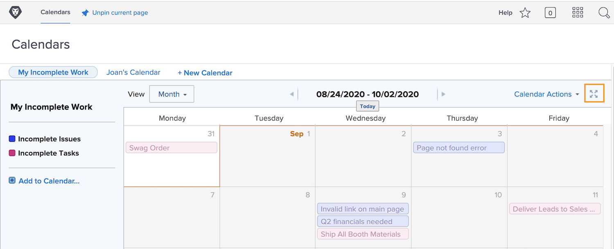

# Förstå kalendergränssnittet

I det här avsnittet får du lära dig mer om:

* Kalendergrupper
* Kalendervyer
* Menyn Kalenderåtgärder
* Och hur du skapar ett ad hoc-kalenderobjekt

Innan du skapar egna kalendrar ska vi ta en titt på de grundläggande funktionerna som finns i anpassade kalendrar.

## Kalendergrupper

En enda kalender kan organiseras i distinkta grupperingar av arbetsobjekt. Varje gruppering kan aktiveras och inaktiveras, vilket gör att användarna kan fokusera på de arbetsuppgifter som är viktigast i vilket ögonblick som helst.

## Kalendervyer

Kalendern kan visas i månad, vecka eller [!UICONTROL Gantt] format. Använd rullningslisten på sidan eller pilarna högst upp för att gå igenom kalendern. The [!UICONTROL Gantt] kan du se ditt arbete från ett annat perspektiv. Hitta den vy som passar dig bäst.

![En bild av kalenderskärmen i [!UICONTROL Gantt] visa](assets/calendar-1-1bb.png)

## [!UICONTROL Kalenderåtgärder] meny

Precis som andra arbetsuppgifter har kalendrar [!UICONTROL Åtgärder] meny, där du kan visa helger i en kalender; radera eller kopiera en kalender, dela en kalender med enskilda Workfront-användare, i hela systemet eller med externa användare, och lägg till kalendern i [!UICONTROL Favoriter] -menyn.

![En bild av [!UICONTROL Kalenderåtgärder] screen](assets/calendar-1-1c.png)

## Helskärmsläge

Visa kalendern i helskärmsläge genom att klicka på helskärmsikonen. Klicka igen om du vill återgå till den ursprungliga storleken.

## Sammanfattningsinformation

Markera ett objekt i kalendern om du vill visa sammanfattningsinformation för det objektet, inklusive namn, ursprungligt projekt, status, tilldelning, förloppsstatus och förfallodatum.

## Ad hoc-händelser

Dubbelklicka för att skapa ad hoc-händelser i en kalender som representerar ditt schema eller andra arbetsobjekt.

>[!NOTE]
>
>Att skapa en ad hoc-händelse skapar INTE en uppgift i Workfront.

