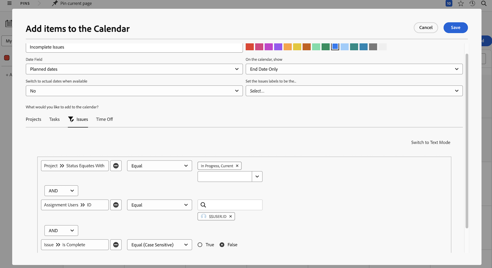

# Din tur är att skapa en kalenderrapport

I den här aktiviteten får du erfarenhet av att skapa en egen kalender.

## Aktivitet: Skapa en kalender

Skapa en kundkalender med namnet&quot;Mitt ofullständiga arbete&quot;.

Inkludera en kalendergrupp med namnet&quot;Ofullständiga uppgifter&quot; som visar alla ofullständiga uppgifter som du har tilldelats i aktuella projekt.

Välj röd som färg för dessa objekt.

Inkludera en annan kalendergrupp med namnet&quot;Ofullständiga problem&quot; som visar alla ofullständiga utgåvor som du har tilldelats i Aktuella projekt. Välj blått som färg för dessa objekt.

## Svar

1. Navigera till området Kalendrar på huvudmenyn.
1. Klicka på knappen Ny kalender och ge kalendern namnet&quot;Mitt ofullständiga arbete&quot;.
1. Klicka på knappen Lägg till i kalender och sedan på Lägg till avancerade objekt.
1. I fönstret Lägg till objekt i kalendern som visas ger du gruppen namnet&quot;Ofullständiga uppgifter&quot;.
1. Välj röd som färg.
1. Ändra datumfältet till planerade datum.
1. Ställ in fältet På kalendern till Endast slutdatum.
1. Ställ in värdet Nej för fältet Växla till faktiska datum när det är tillgängligt.
1. I avsnittet Vad vill du lägga till i kalendern? väljer du Åtgärder. Klicka sedan på knappen Lägg till uppgifter.
1. Lägg till tre filterregler:

   * Projekt > Status är lika med med > Lika > Aktuell
   * Tilldelningsanvändare > ID > Lika med > $$USER.ID
   * Aktivitet > Är fullständig > Lika > Falskt

1. Klicka på Spara.

   

1. Skapa en andra gruppering genom att klicka på Lägg till i kalender och sedan Lägg till avancerade objekt.
1. I fönstret Lägg till objekt i kalendern som visas ger du gruppen namnet&quot;Ofullständiga problem&quot;.
1. Välj blått som färg.
1. Ändra datumfältet till planerade datum.
1. Ställ in fältet På kalendern till Endast slutdatum.
1. Ställ in värdet Nej för fältet Växla till faktiska datum när det är tillgängligt.
1. I avsnittet Vad vill du lägga till i kalendern? väljer du Problem. Klicka sedan på knappen Lägg till problem.
1. Lägg till följande tre filterregler:

   * Projekt > Status är lika med med > Lika > Aktuell
   * Tilldelningsanvändare > ID > Lika med > $$USER.ID
   * Problem > Är fullständigt > Lika > Falskt

1. Klicka på Spara.

   

Eftersom du har använt $$USER.ID i filtren kan du dela den här kalendern med andra och de kan se sina egna ofullständiga uppgifter och problem.
