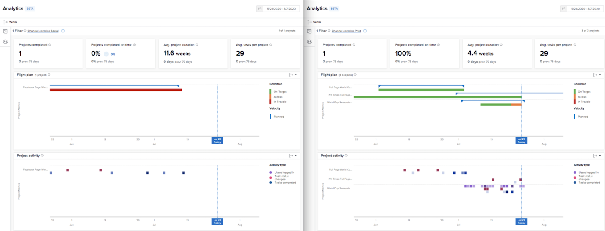

# Förstå nyckeltal i [!UICONTROL Förbättrad analys]

I den här videon får du lära dig:

* Så här får du värde från KPI-data

>[!VIDEO](https://video.tv.adobe.com/v/335046/?quality=12&learn=on)

## Jämför KPI:er

KPI:er ger inte bara värdefull information om vad som händer i nuläget, utan de ger användarna möjlighet att jämföra förändringar i aktivitet över tid eller skillnaden mellan portföljer, program, projektägare eller andra filter som används.

Du kan till exempel hämta analyser på två webbläsarflikar för att jämföra KPI:er.
