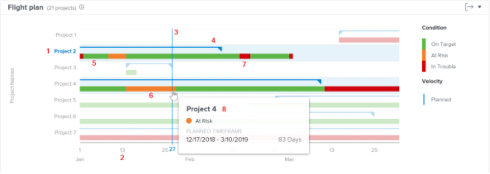

# Förstå navigering och granskning av projekt

I den här videon får du lära dig:

* Läs Flight-planen

>[!VIDEO](https://video.tv.adobe.com/v/335047/?quality=12&learn=on)

## Flygplanskarta

I diagrammet ser du:

1. Projektnamn finns till vänster.
1. Datum visas längst ned.
1. Den lodräta blå linjen visar det datum då musen hovrar.
1. Vågräta blå rader visar projektets planerade start- och slutdatum.
1. Gröna linjer anger att projektet ligger på mål.
1. Orange rader anger att projektet är i riskzonen.
1. Röda linjer anger att projektet är i problem.

Om du ser den här informationen om dina projekt blir det lättare att avgöra:

* Vilka händelser som förlänger ett projekt efter det planerade slutförandedatumet.
* När ett projekt börjar stöta på problem.
* Hur många projekt som är öppna under samma tidsperiod.
* Hur många projekt som är aktiva.
* Vilka projekt som behöver extra uppmärksamhet eller support.

## Villkoret baseras på förloppsstatus

Projektvillkoret är en visuell representation av hur projektet fortskrider. Workfront fastställer villkoret baserat på förloppsstatus för uppgifter i projektet.

Ett projekts villkor kan anges:

* **Manuellt**, av användare med åtkomst för att hantera projektet, när projektets villkorstyp är inställd på manuell. På så sätt kan du ange projektvillkoren oberoende av den kritiska vägen.
* **Automatiskt**, av Workfront, när villkorstypen för projektet är inställd på Status.

Workfront rekommenderar att du anger villkorstypen till Progress Status så att du får en tydlig indikation på projektets verkliga förlopp, baserat på förloppet för dina uppgifter.

Om du anger Status för projektet kan det vara:

* **På mål** - När förloppsstatusen för den senaste aktiviteten på den kritiska sökvägen är I tid, kommer projektvillkoret att vara På mål. Projektet är på väg att avslutas enligt schemat.
* **Vid risk** - När förloppsstatusen för den sista aktiviteten på den kritiska sökvägen är Efter eller Vid risk är villkoret för projektet Vid risk. Projektet är på väg att avslutas sent, men är inte sent ännu.
* **I problem** - När förloppsstatusen för den senaste aktiviteten på den kritiska sökvägen är Sent är projekttillståndet i problem. Förfallodatumet har redan inträffat och projektet är nu försenat.

>[!NOTE]
>
>Villkoren kan anpassas efter din miljö, så du kan hitta fler än tre alternativ eller så kan namnen skilja sig från de ovan. Mer information om hur du anpassar villkor finns i artikeln [Skapa eller redigera ett anpassat villkor](https://experienceleague.adobe.com/docs/workfront/using/administration-and-setup/customize/custom-conditions/create-edit-custom-conditions.html?lang=en).
