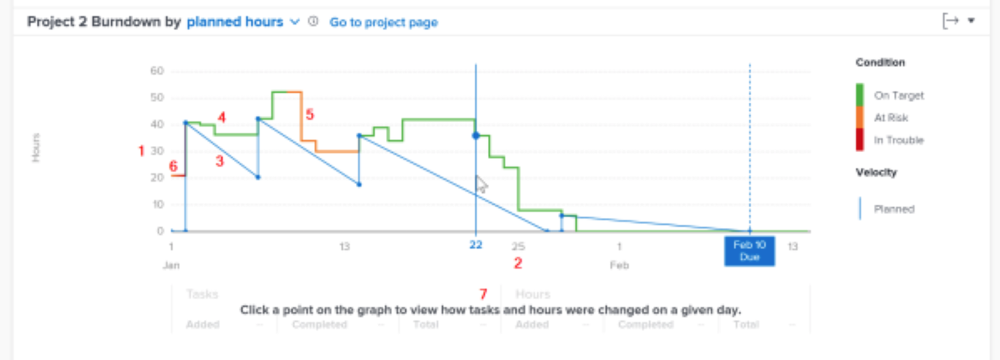

# Förstå åtkomst till och granska nedladdningen

I den här videon får du lära dig:

* Åtkomst till nedladdningsschemat
* Hur du förstår förhållandet mellan återstående timmar, projektvillkor och hastighet för ett projekt

>[!VIDEO](https://video.tv.adobe.com/v/335051/?quality=12&learn=on&enablevpops)

## Spåra projektets hastighet

Med nedladdningsschemat kan du förstå förhållandet mellan återstående timmar, projektvillkor och hastighet. Den heldragna raden visar hur många timmar som har ägnats åt projektet över tid samt projektets skick varje dag. Den streckade raden, som visar den planerade hastigheten från startdatumet till det planerade slutförandedatumet, justeras när datum för uppgifter ändras.

Om du ser den här informationen blir det lättare att avgöra:

* Hur problem i samband med (oplanerat arbete) påverkade det planerade arbetet.
* Vilka händelser som förlängde ditt projekt efter det planerade slutförandedatumet.

I diagrammet ser du:

1. Antal timmar till vänster.
1. Datum visas längst ned, inklusive projektets planerade slutförandedatum om det finns i det valda datumintervallet.
1. Den blå heldragna linjen visar hastigheten för projektet (antingen planerad tid eller tid) och blir en streckad vertikal linje när det planerade slutdatumet för projektet nås.
1. Gröna linjer anger när projektvillkoret är På mål.
1. Orange rader anger när projektvillkoret är Vid risk.
1. Röda linjer anger när projekttillståndet är i problem.
1. Information om uppgifter och timmar (summor, belopp och slutfört belopp) på en viss dag visas under x-axeln när du klickar på en viss punkt i diagrammet.
