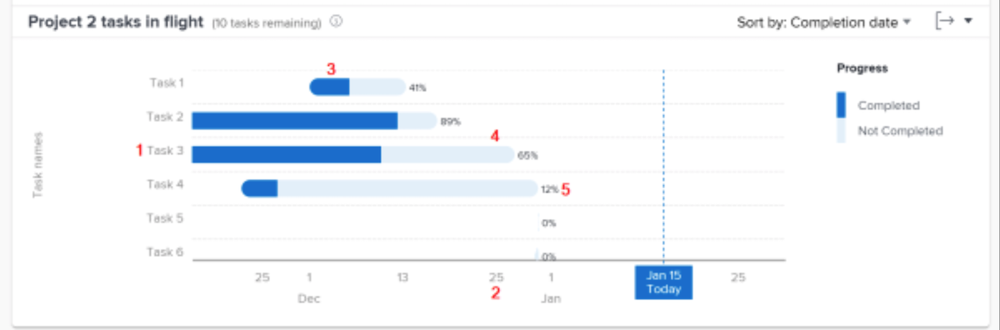

# Granska pågående uppgifter i [!UICONTROL Förbättrad analys]

I den här videon får du lära dig:

* Så här kommer du åt uppgifter i flightdiagram
* Så här ser du snabbt vilka uppgifter som inte har slutförts i ett projekt

>[!VIDEO](https://video.tv.adobe.com/v/335052/?quality=12)

## Data på aktivitetsnivå

Med uppgifterna i flygdiagrammet kan du gå igenom ett specifikt projekts uppgifter för att se hur mycket arbete som har slutförts för varje aktiv uppgift och hur enligt tidsplanen uppgifterna är. I diagrammet kan du förstå vilka uppgifter i ett projekt som behöver slutföras och hur stor procentandel av slutförandet som krävs för dessa uppgifter.

Den här informationen kan hjälpa dig att avgöra:

* Vad folk jobbar med.
* Vilka uppgifter skulle kunna utgöra en risk för ett projekt.
* Hur nära en uppgift är att slutföra.
* Vem du ska prata med om en viss uppgift.

I diagrammet ser du:

1. Uppgiftsnamn till vänster.
1. Datum längst ned.
1. Den mörkblå färgen i ett aktivitetsfält anger mängden arbete som har slutförts för en uppgift.
1. Den ljusblå färgen i ett aktivitetsfält anger mängden arbete som behöver utföras för en uppgift.
1. Siffran till höger om ett aktivitetsfält visar aktivitetens procentandel slutförda.
