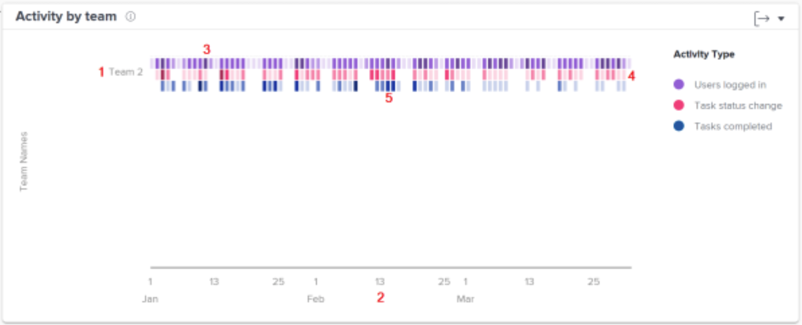

# Förstå aktiviteten per team-diagram i [!UICONTROL Förbättrad analys]

Med Activity by team-diagram kan ni förstå hur organisationens hemteam tillbringar sin tid i Workfront. Workfront-användare kan befinna sig i flera team, men de kan bara befinna sig i ett hemteam. Teamen som används i personschemat består endast av de användare som har det teamet utsett som sitt hemteam.

Aktiviteter - användare som är inloggade, ändringar av uppgiftsstatus och slutförda uppgifter - visas i olika färger för att sammanfatta dessa händelser under den filtrerade tidsperioden.

Om du ser den här informationen blir det lättare att avgöra:

* Vilka aktiviteter som pågår inom ett hemteam och i vilken takt.
* Vilka hemteam som jobbar för mycket eller använder systemet mer.
* Om arbetsfördelningen är lämplig för hemteamet.

I diagrammet ser du:

1. Hemmagruppnamn till vänster.
1. Datum längst ned kommer från det valda datumintervallet.
1. Lila rutor visar att användare som tilldelats projektet loggade in den dagen, med en mörkare ton som anger att fler användare loggar in.
1. Rosa rutor visar att användare ändrade status för en aktivitet den dagen, med en mörkare ton som anger att ett högre antal uppgiftsstatusvärden ändras.
1. Blå rutor visar att användarna har slutfört en uppgift för projektet, med en mörkare ton som anger att fler uppgifter har slutförts.
