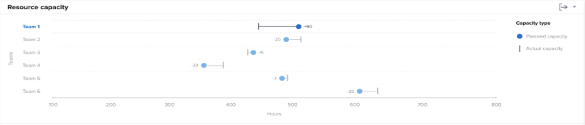

# Lär dig mer om resurskapaciteten i [!UICONTROL Förbättrad analys]

Resurskapaciteten visar antalet planerade timmar som tilldelats ett hemteam inom den filtrerade tidsperioden jämfört med teamets totala tillgängliga timmar.

Den här jämförelsen kan hjälpa dig att avgöra om du inte tilldelar tillräckligt med arbete till teamet eller om de kan drabbas av problem på grund av en hög arbetsbelastning. Klicka på ett teamnamn så visas ett Team-kapacitetsdiagram med mer information om teamets kapacitet för den filtrerade tidsperioden.

Om du ser den här informationen blir det lättare att avgöra:

* Om ett hemteam var övertilldelat eller undertilldelat.
* Vilka hemteam som finns tillgängliga för jobbet.

I diagrammet visas följande nyckelinformation:

1. Hemmagruppernas namn är till vänster.
1. Timmar är längst ned. Det här är x-axeln i diagrammet och beräknar till det timintervall som visas i team ovan.
1. Cirkeln visar antalet planerade timmar som tilldelats hemteamet.
1. Den lodräta raden visar det totala antalet timmar som är tillgängliga för hemteamet.

## Navigera till diagrammet

1. Klicka på [!UICONTROL Folk] i den vänstra panelen.
1. Använd [!UICONTROL Filter] för att välja ett eller flera hemteam att undersöka.
1. Du kommer att se [!UICONTROL Resurskapacitet] visas under teamaktivitetsdiagrammet.

## Använda diagrammet

Du måste lägga till filter och välja ett datumintervall för att visa data i diagrammen i [!UICONTROL Förbättrad analys] Workfront. Om du har lagt till filter tidigare är de aktiva tills du tar bort dem.

I resurskapaciteten kan du:

* Håll muspekaren över teamlinjen för att se hur många timmar som fortfarande är tillgängliga för schemaläggning, hur många timmar som hemteamet ska klara av och det totala antalet arbetade timmar (märkt som över, under eller som kapacitet).
* Exportera diagramdata med exportknappen i diagrammets övre högra hörn.
* Klicka på hemteamets namn för att öppna teamets kapacitetstabell. Om du zoomar in till en kortare tidsram i teamkapacitetstabellen uppdateras de data som visas i resurskapaciteten.
