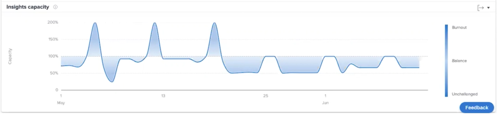

# Förstå teamets kapacitet

Teamkapacitetstabellen visar när ett hemteam var övertilldelat eller undertilldelat. Diagrammet visar den arbetsvolym som tilldelats hemarbetsteamet en viss dag och tilldelar en mörkare blå färg när de närmar sig utbränning eller inte ifrågasätts. En ljusare, mer genomskinlig färg anger att arbetsbelastningen är mer balanserad.

Om du ser den här informationen blir det lättare att avgöra:

* När hemteamet var övertilldelat eller undertilldelat.
* Om hemteamet är övertilldelat eller undertilldelat dagligen.
* Hur konsekvent ett hemteams arbetsbörda är från dag till dag.
* Om du skapar kapacitetsproblem med nytt arbete.

I diagrammet ser du:

1. Procentandelen av hemteamets kapacitet är till vänster.
1. Datum längst ned kommer från det valda datumintervallet.
1. Den mörkare blå fyllningsfärgen anger att hemteamet antingen har utbränt (4) eller inte har någon utmaning.
1. Den ljusare eller mer genomskinliga blå indikerar att hemgruppens arbetsbelastning är balanserad

## Navigera till diagrammet

1. Klicka på [!UICONTROL Folk] i den vänstra panelen.
1. Använd [!UICONTROL Filter] för att välja ett eller flera hemteam att undersöka.
1. Teamkapaciteten visas.

## Använda diagrammet

Om du vill visa data i diagram i avsnittet Personer i analysområdet måste du lägga till filter och välja ett datumintervall. Om du har lagt till filter tidigare är de aktiva tills du tar bort dem.

I teamkapacitetsdiagrammet kan du:

* Håll pekaren över en punkt i diagrammet för att se datumraden.
* Håll muspekaren över en punkt på den graderade linjen för att se de schemalagda timmarna och de planerade timmarna för det angivna datumet, samt kapacitetsprocenten och om hemteamet var över, under eller på kapaciteten just nu.
* Zooma in datum genom att klicka och dra musen över en viss punkt i projektet. (Den här åtgärden uppdaterar alla andra diagram för att zooma in i samma datumintervall.)
* Exportera diagramdata med exportknappen i diagrammets övre högra hörn.
