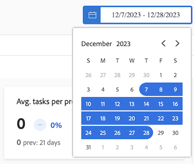
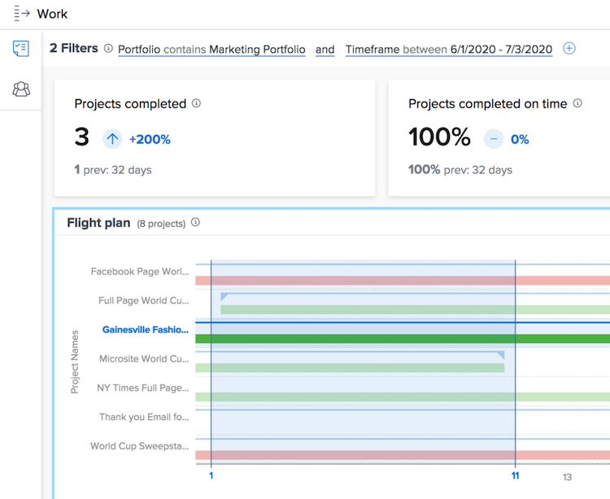

# Förstå datumintervall och tidsramar

När du visar [!DNL Enhanced analytics]-diagram anges datumintervall med hjälp av kalenderwidgeten. Tidsramar skapas i ett diagram när du klickar och drar för att definiera ett visst område, så att du kan zooma in och få en mer detaljerad bild av informationen under tidsramen.

## Datumintervall

Klicka bara på ett datum i kalendern för att ange ett datum i intervallet och klicka sedan på ett datum för att ange det andra slutet av intervallet. Använd pilarna högst upp i kalendern för att navigera till en annan månad om start- och slutdatumen inte är samma månad.

Diagrammen i [!DNL Analytics] visar data för de senaste 60 dagarna och de kommande 15 dagarna som standard. Du kan välja ett nytt datumintervall och använda det på alla diagram när du använder [!DNL Analytics].

När du uppdaterar sidan, navigerar bort eller loggar ut/in från Workfront återställs datumintervallet till standardvärdet.

## Tidsbildrutor

Klicka och dra runt ett önskat avsnitt i en tidslinje för att skapa ett tidsbildrutefilter. Den här tidsramen gäller nu för alla diagram i arbetsytan, och den visas bredvid eventuella andra filter i filterfältet. Gå djupare in i ett diagram genom att klicka och dra runt områden för att uppdatera tidsramen. Om du vill ta bort tidsbildrutefiltret håller du pekaren över det i filterfältet och klickar på det X som visas.

När du uppdaterar sidan, navigerar bort eller loggar ut från Workfront tas tidsramen bort och datumintervallet återställs.

>[!NOTE]
>
>Du kan inte använda det här alternativet för tidsramar med treemap-schemat för projekt.
