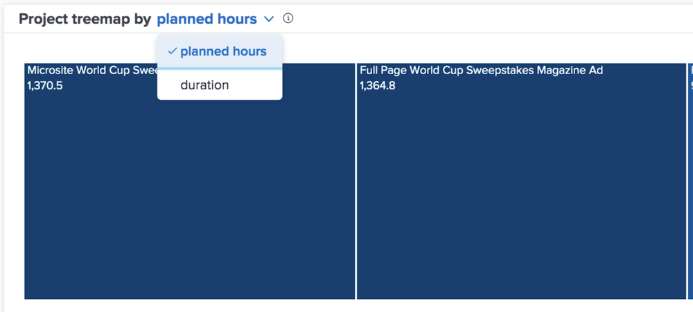

# Förstå planerade timmar och varaktighetsvyer

I tidsschemat för nedladdning och projekt kan du se informationen efter planerad tid eller varaktighet, beroende på vad du tycker är mer exakt för din Workfront-miljö.

Planerade timmar är standard. Om du växlar till längd gäller detta även om du navigerar bort från [!DNL Analytics] och kommer tillbaka och mellan Workfront-inloggningar.

## Vad betyder rutstorlek och färgton?

Mindre, ljusare blå rutor visar färre timmar medan större rutor och mörkare nyanser av blått visar fler timmar i jämförelse. Mer information finns i [Förstå visualiseringen av projektteamen](https://experienceleague.adobe.com/docs/workfront/using/reporting/enhanced-analytics/project-treemap-overview.html?lang=en).
