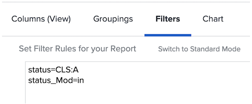

# Grundläggande textläge för filter

I den här videon får du lära dig:

* Vilket textläge är
* Vad kamelväska är
* Vissa grundläggande textlägen för plug and play som du kan använda i rapportfiltren

>[!VIDEO](https://video.tv.adobe.com/v/336820/?quality=12)

I följande textläge exkluderas uppgifter där en användare har markerat &quot;Klar med min del&quot;. Allt du behöver göra är att skapa ett uppgiftsfilter, lägga till eventuella filterregler, växla sedan till textläge och klistra in koden nedan efter det textläge som visas i filtret.

```
EXISTS:1:$$OBJCODE=ASSGN  
EXISTS:1:taskID=FIELD:ID  
EXISTS:1:status=DN  
EXISTS:1:status_Mod=notin  
EXISTS:1:assignedToID=$$USER.ID 
```

## Aktivitet: Frågor om textläge

1. Hur skriver du kamerans skiftläge för fältet med namnet&quot;Angivet av ID&quot;?
1. I en problemrapport skapar du ett filter som visar problem som har markerats som stängda men som väntar på godkännande.

## Svar

1. Kamerafodralet för fältet&quot;Anges med ID&quot; ska skrivas så här - enteredByID
1. Textläget bör se ut så här i utgivningsrapportfiltret:

   
