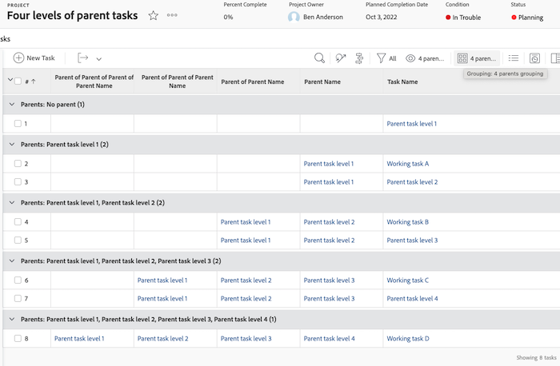

# Grundläggande textläge för grupperingar

>[!IMPORTANT]
>
>Förutsättningar:
>
>* Förstå rapportelement
>* Förstå rapporteringskomponenter
>* Skapa en grundläggande gruppering

>[!TIP]
>
>* Vi rekommenderar att du tittar på det inspelade webbinariet för att få en bättre förståelse för textläget [Fråga experten - Introduktion till rapportering i textläge](https://experienceleague.adobe.com/docs/workfront-events/events/reporting-and-dashboards/introduction-to-text-mode-reporting.html?lang=en), som är en timme lång.
>* Vi rekommenderar att du tittar på [Avancerad rapportering](https://experienceleague.adobe.com/docs/workfront-learn/tutorials-workfront/reporting/advanced-reporting/welcome-to-advanced-reporting.html?lang=en) självstudiekurser, som tillsammans är fem och en halv timme långa.

I den här videon får du lära dig:

* Vilket textläge är
* Vad kamelväska är
* Vissa grundläggande textlägen för plug and play som du kan använda i dina grupperingar

>[!VIDEO](https://video.tv.adobe.com/v/3410641/?quality=12&learn=on)

## Aktivitet - 4 överordnade grupperingar

I följande textläge grupperas uppgifter baserat på upp till fyra nivåer med överordnade och överordnade som inte finns tomma lämnas.

```
textmode=true
group.0.name=Parents
group.0.valueexpression=CONCAT({parent}.{parent}.{parent}.{parent}.{name},IF(ISBLANK({parent}.{parent}.{parent}.{parent}.{name}),"",", "),{parent}.{parent}.{parent}.{name},IF(ISBLANK({parent}.{parent}.{parent}.{name}),"",", "),{parent}.{parent}.{name},IF(ISBLANK({parent}.{parent}.{name}),"",", "),IF(ISBLANK({parent}.{name}),"No parent",{parent}.{name}))
group.0.linkedname=parent
group.0.namekeyargkey.0=parent
group.0.namekeyargkey.1=name
group.0.valueformat=string
```




## Aktivitet - Procent slutförd gruppering

I följande textläge grupperas uppgifter baserat på hur många procent de har slutförts. Aktiviteter hamnar i någon av följande kategorier när de grupperas:

* 0%
* 1 till 25 %
* 26 till 50 %
* 51 till 75 %
* 76 % till 99 %
* 100%

```
group.0.linkedname=direct
group.0.namekey=percentComplete
group.0.valueexpression=IF({percentComplete}<1,"0%",IF({percentComplete}<26,"1% to 25%",IF({percentComplete}<51,"26% to 50%",IF({percentComplete}<76,"51% to 75%",IF({percentComplete}<100,"76% to 99%",IF({percentComplete}=100,"100","***"))))))
group.0.valueformat=doubleAsString
textmode=true
```


## Aktivitet - statusEquatesWith, sedan status

I följande textläge grupperas uppgifter efter statusEquatesWith och sedan efter status.

```
group.0.enumclass=com.attask.common.constants.TaskStatusEnum
group.0.enumtype=TASK
group.0.linkedname=direct
group.0.name=State
group.0.type=enum
group.0.valuefield=statusEquatesWith
group.0.valueformat=val
group.1.enumclass=com.attask.common.constants.TaskStatusEnum
group.1.enumtype=TASK
group.1.linkedname=direct
group.1.namekey=status
group.1.type=enum
group.1.valuefield=status
group.1.valueformat=val
textmode=true
```


## Godkännandebevis - gruppera efter projektnamn

```
group.0.valueformat=HTML
group.0.valuefield=documentVersion:document:project:name
group.0.displayname=Project Name
```


## Godkännandebevis - gruppera efter dokumentnamn

```
group.0.displayname=Document Name
group.0.valuefield=documentVersion:document:name
group.0.valueformat=HTML
```


