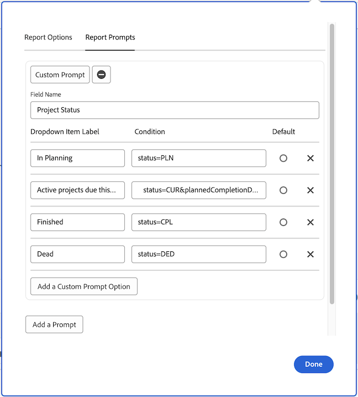

# Skapa egna uppmaningar

I den här videon får du lära dig:

* Vad en anpassad fråga är
* Hur man skapar en egen fråga i textläge
* Några exempel som du kan använda i dina rapporter

>[!VIDEO](https://video.tv.adobe.com/v/336822/?quality=12)

## Aktivitet: Skapa egna uppmaningar

1. Skapa en anpassad fråga som visar följande projektstatus i den nedrullningsbara menyn:
   * Planering
   * Aktuell
   * Slutförd
   * Död
1. Ändra uppmaningen för att visa aktuella projekt som förfaller den här månaden.

## Svar

1. Dina anpassade uppmaningar bör se ut ungefär så här och ha följande textläge:

   

   När du har sparat den anpassade prompten bör den nedrullningsbara menyn se ut så här:

1. Textläget i den anpassade prompten ska se ut så här:


```
   status=CUR&plannedCompletionDate=$$TODAYbm&plannedCompletionDate_Mod=between&plannedCompletionDate_Range=$$TODAYem 
```

Listruteetiketten för aktiva uppmaningar bör uppdateras för att återspegla ändringen i koden så här:


