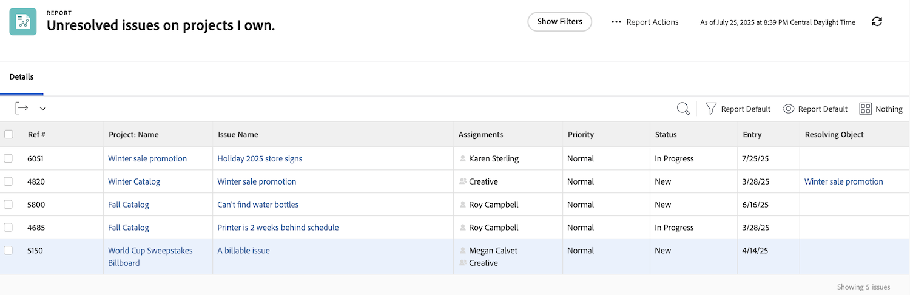

# Förstå inbyggda problemfilter

I den här videon kommer du att:

* Granska de inbyggda problemfiltren och se hur de byggs
* Läs mer om några användbara element för problemrapportering
* Lär dig hur du skapar ett eget problemfilter

>[!VIDEO](https://video.tv.adobe.com/v/336819/?quality=12&learn=on)

## Aktivitet: Skapa en problemrapport

Du vill se alla problem som fortfarande behöver lösas i alla aktiva projekt som du äger, inklusive problem med ett löst objekt. Skapa en problemrapport och ge den namnet&quot;Olösta problem i projekt jag äger&quot;.

## Svar

Så här ska filtret se ut:

I det inbyggda filtret&quot;Mina öppna problem&quot; exkluderade en av filterreglerna problem där det fanns ett matchande objekt. Skälet till detta är att ni inte behöver bekymra er om dessa problem. Någon har redan skapat ett projekt, en uppgift eller ett problem som löser dem, så vad ska du oroa dig för? Men de är inte lösta än, och i vårt exempel inkluderar vi dem för att göra det enkelt att identifiera och kontrollera hur de fungerar.

För att göra detta måste du lägga till en kolumn på fliken Visa för&quot;Problem > Lösa objekt&quot;. Här visas namnet på det matchande objektet, om det finns något, oavsett om det är ett projekt, en uppgift eller ett problem. När du klickar på namnet kommer du till det objekt som ska matchas.

Du kanske vill gruppera listan baserat på projektets namn.

Så här ska rapporten se ut:

