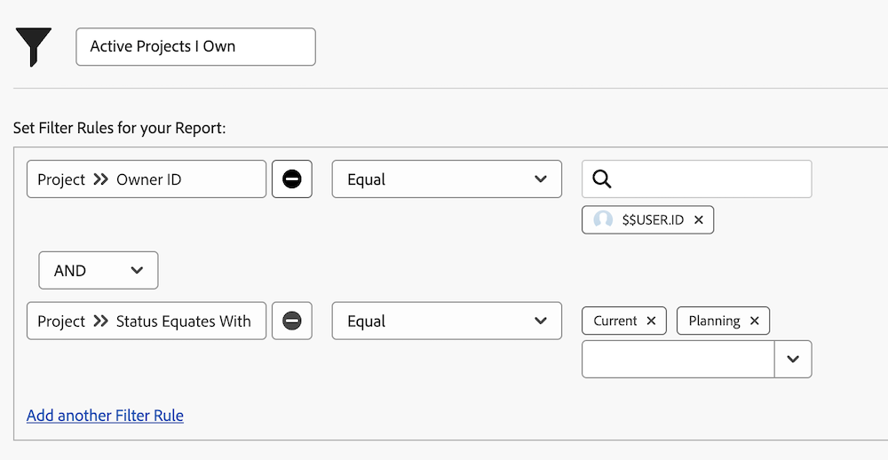

# Utforska inbyggda projektfilter

I den här videon får du lära dig att:

* Granska de inbyggda projektfiltren och se hur de byggs
* Skapa ett eget projektfilter med hjälp av det du lärt dig

>[!VIDEO](https://video.tv.adobe.com/v/336817/?quality=12&learn=on&enablevpops=0)

## Inbyggda projektfilter

### Aktivitet: Skapa ett projektfilter

Du vill se alla aktiva projekt som du äger, där&quot;aktiv&quot; betyder projektstatusen är lika med Planering eller Aktuell. I området Projekt skapar du ett projektfilter med namnet&quot;Aktiva projekt jag äger&quot;.

### Svar

Filtret ska se ut så här:

Du kan inkludera ytterligare filterregler, som att söka efter projekt i ett visst program eller en viss portfölj. När du gör det rekommenderar Workfront att du byter namn på filtret till något som är lämpligt beskrivande, som&quot;Active Projects I Own in the Marketing Portfolio&quot;.
