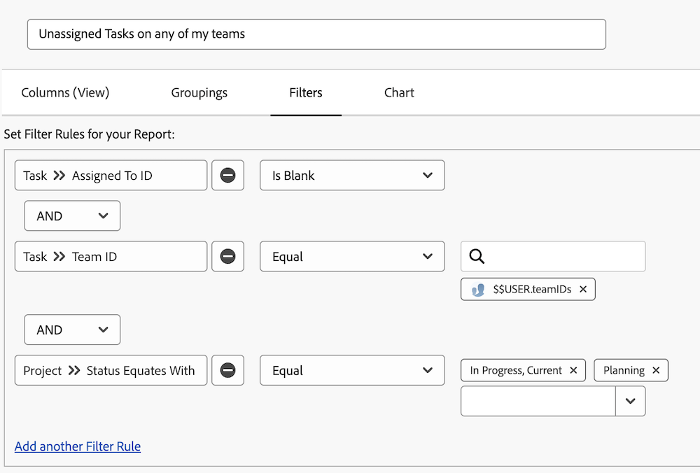

# Förstå inbyggda uppgiftsfilter

I den här videon kommer du att:

* Granska de inbyggda uppgiftsfiltren och se hur de byggs
* Läs mer om några användbara element för uppgiftsrapportering
* Lär dig hur du skapar ett eget uppgiftsfilter

>[!VIDEO](https://video.tv.adobe.com/v/3469593/?quality=12&learn=on&captions=swe)

## Inbyggda aktivitetsfilter

### Aktivitet: Skapa en uppgiftsrapport

Du måste vara medveten om att någon i teamet har gått med på att arbeta med uppgifter som tilldelats en. Skapa en aktivitetsrapport med namnet&quot;Ej tilldelade uppgifter&quot; för något av mina team.

### Svar

Så här ska filtret se ut:

Ställ in kolumnvyn så att den innehåller de fält som du är intresserad av eller vill kunna redigera direkt. Du kan till exempel inkludera en uppdragskolumn så att du kan tilldela en teammedlem till en uppgift direkt från rapporten.

Du kanske vill gruppera listan baserat på namnet på det team som tilldelats för varje uppgift.

Så här ser rapporten ut:

