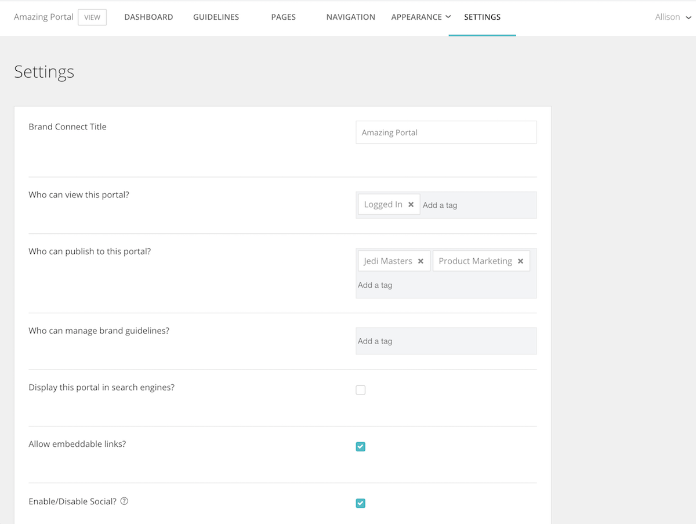

# Upprätta systeminställningar i [!UICONTROL Brand Connect]

The [!UICONTROL Brand Connect] -inställningarna styr vilka som kan se portalen, vem som kan publicera innehåll på portalen och vem som kan hantera varumärkesriktlinjerna.

Logga in på [!UICONTROL Workfront DAM].

1. Klicka på **inställningsikon** i navigeringsfältet och välj **[!UICONTROL Brand Connect]**. Eller klicka **[!UICONTROL Varumärken]** i navigeringsfältet.
1. Klicka sedan på **[!UICONTROL Redigera]** i det övre högra hörnet av [!UICONTROL Brand Connect] -panelen. Om din organisation har flera [!UICONTROL Märkesanslutningar]måste du se till att du redigerar rätt.

Tala med [!UICONTROL Workfront] om du har frågor om någon av dessa inställningar.

* **[!UICONTROL Brand Connect] Titel**—Ange namnet [!UICONTROL Brand Connect] (eller ändra namnet).
* **Vem kan visa den här portalen?**—Ange vilka grupper som kan visa [!UICONTROL Brand Connect]. Om du till exempel lägger till [!UICONTROL Inloggad] så kan alla inloggade användare se portalen. Mappbehörigheterna gäller dock fortfarande, så även om en användare kan se portalen kan de inte komma åt resurser såvida inte [!UICONTROL Inloggad] gruppen fick behörighet till mappen.
* **Vem kan publicera på den här portalen?**—Ange grupper som kan publicera resurser på [!UICONTROL Brand Connect]. Dessa är grupper för medverkande. De kan bara publicera objekt som de har tillgång till.
* **Vilka kan hantera varumärkesriktlinjerna?**—Ange de grupper som kan hantera varumärkesriktlinjerna. Riktlinjerna hanteras inte bara av administratörer. Du kan ställa in en medverkande grupp för att redigera riktlinjerna.
* **Vill du visa den här portalen i sökmotorer?**—Vill du ha [!UICONTROL Brand Connect] URL som visas när någon kör sökningar på Internet?
* **Tillåt inbäddade länkar?**—Kan inbäddade länkar komma från [!UICONTROL Brand Connect]? Detta lägger till en [!UICONTROL Hämta länkar] till [!UICONTROL Dela] meny som innehåller inbäddade länkar för resursen.
* **Aktivera/inaktivera sociala medier?**—Om sociala medier är aktiverade (markera kryssrutan) kan användarna gilla och kommentera resurser.
* **Aktivera/inaktivera hämtning och visa antal?**- När det här alternativet är aktiverat kan användarna se hur många gånger en resurs har laddats ned och hur många kommentarer den har.
* **Dölj ansikten från början**—Dölj metadatasökfiltren som visas i den vänstra panelen på panelen [!UICONTROL Resurser] sida.
* **Ljuslådeetikett**—Välj en etikett för [!UICONTROL Ljuslådor] — [!UICONTROL Ljuslåda], [!UICONTROL Samling], [!UICONTROL Favoriter], eller [!UICONTROL Favoriter].
