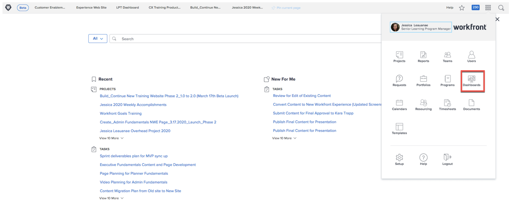
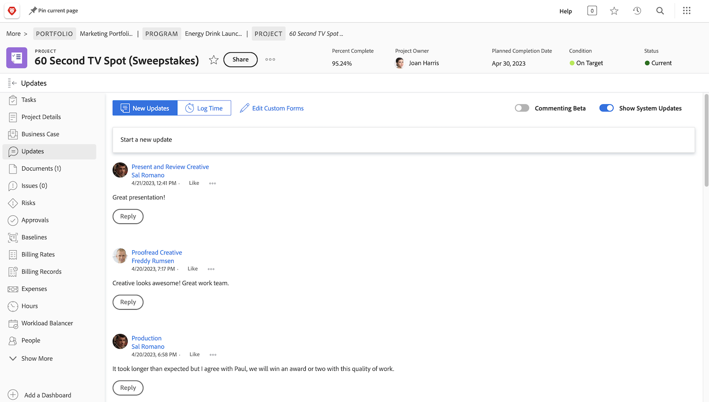

# Workfront för chefer

Läs om hur Workfront kan hjälpa er att hantera arbetet i er organisation.

Som företagsledare kan Adobe Workfront

* Håll dig informerad om hur arbetet fortskrider genom **rapporter och instrumentpaneler**
* Ge dig ett enkelt sätt att **kommunicera med projektintressenter med uppdateringar**
* Ge dig ett enkelt sätt att **göra en arbetsförfrågan**
* Gör det enkelt att se **objekt som väntar på ditt godkännande**

## Rapporter och kontrollpaneler

### Rapporter

Rapporterna i Workfront är grunden till bättre beslut, snabbare. Du kan se dem överallt - i projektområdet, i personområdet eller på en startsida för en uppgift.

Ledare och chefer kan navigera till rapportområdet för att visa anpassade rapporter med specifik information. För att synliggöra de viktigaste rapporterna använder Workfront kontrollpaneler.

### Kontrollpaneler

Genom att använda en kontrollpanel kan de ansvariga visa och snabbt gå ned i vilken del av arbetet de arbetar med just nu. Kontrollpanelen är helt enkelt en samling rapporter som innehåller information som de kan behöva se regelbundet. Kontrollpanelerna är helt anpassningsbara så att alla som använder Workfront kan se material som är viktigt för dem.

Klicka på Kontrollpaneler på huvudmenyikonen i det övre högra hörnet för att öppna området Kontrollpaneler.

Ledarna kan komma åt de olika instrumentpanelerna som är tillgängliga via den vänstra panelnavigeringen.

* **Alla instrumentpaneler**: Visar de instrumentpaneler som du eller andra användare har skapat och som du har behörighet att åtminstone visa.
* **Mina instrumentpaneler**: Visar de instrumentpaneler som du har skapat.
* **Delade instrumentpaneler**: Visar de instrumentpaneler som har skapats av andra användare och delats med dig.

Med en kontrollpanel kan chefer granska saker som&quot;Kostnader, intäkter och budgetar&quot; för viktiga projekt och öppna problem som deras team har att göra med. De kan också se projekt som är i riskzonen samt en lista över objekt som behöver godkännas av ledningen.

Rapporterna i Workfront kan bidra till att öka personalens ansvar. Nyckeln till att utnyttja rapporter är att skapa ett tydligt arbetsflöde för hur organisationen använder dem. Se till att alla har en tydlig förståelse för vilka rapporter som används för att mäta framgång.

Exempel på rapporter på en Dashboard i Workfront

## Kommunicera med projektintressenter med hjälp av uppdateringar

Kommunicera med projektteamet i själva projektet så att all projektkommunikation blir lättillgänglig.

## Gör en förfrågan

I många organisationer är det första steget i att starta ett nytt projekt, utveckla en ny produkt eller skapa en slutprodukt att göra en förfrågan i Workfront. Du kan följa förloppet för begäran och ange ytterligare information vid behov.

I den här videon får du lära dig att:

* Navigera till begärandeområdet
* Gör en förfrågan
* Visa dina skickade begäranden

>[!VIDEO](https://video.tv.adobe.com/v/336092/?quality=12&learn=on&enablevpops=1)

## Objekt som väntar på ditt godkännande

I [!UICONTROL Hem] kan du enkelt hitta objekt som väntar på ditt godkännande.

