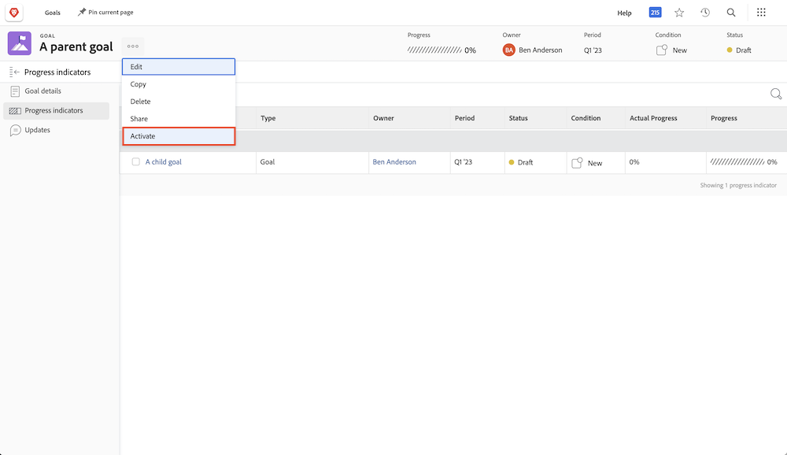

# Aktivera genom att justera ett mål mot ett annat

När du justerar två mål blir det ena det överordnade målet och det andra ett underordnat mål. Ett överordnat mål kan ha flera underordnade mål, men ett underordnat mål kan bara justeras mot ett överordnat mål.

1. Öppna det underordnade målet genom att klicka på dess namn i [!UICONTROL Mållista]. Som standard finns du i [!UICONTROL Målinformation] -fliken.
1. Klicka på [!UICONTROL +Lägg till] knappen i [!UICONTROL Överordnad målinformation] -panelen.

   ![En skärmbild av [!UICONTROL Målinformation] tab](assets/06-workfront-goals-align-goals.png)

1. Börja skriva namnet på det överordnade målet i [!UICONTROL Överordnat mål] markerar du det när det visas i listan. Endast mål från samma period eller en framtida period visas i listan.

   ![En skärmbild av [!UICONTROL Målinformation] panel med [!UICONTROL Överordnad målinformation] panel](assets/07-workfront-goals-align-to.png)

1. Klicka [!UICONTROL Spara ändringar].

Om du justerar ett mål mot ett annat mål skapas ett underordnat mål. Tänk på underordnade mål som individuella mål som bidrar till utvecklingen av organisationens eller teamets överordnade mål. Underordnade mål kan aktivera och påverka förloppet för det överordnade målet.

## Aktivera nu det överordnade målet

Nu när du har skapat ett underordnat mål blir det en förloppsindikator för ditt överordnade mål. Alternativet Aktivera visas när du klickar på menyn med tre punkter bredvid det överordnade målnamnet.

