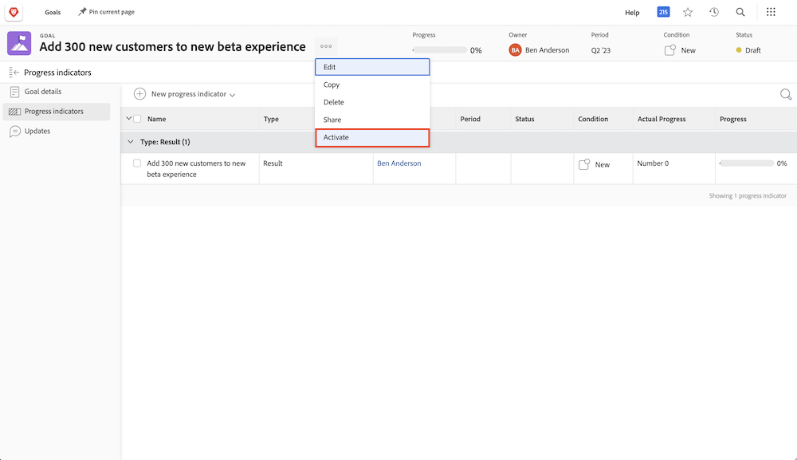

# Aktivera mål

Nu när du har skapat mål kan vi aktivera dem! När du skapar ett mål sparas det i statusen [!UICONTROL Utkast]. [!UICONTROL Utkast] är inte en del av målhanteringen förrän du aktiverar dem. När de har aktiverats växlar de till statusen [!UICONTROL Aktiv] och visar förloppet på kontrollpanelen och hur de anpassar sig till den övergripande strategin. Mål med statusen [!UICONTROL Aktiv] är associerade med en förloppsindikator, vanligtvis en aktivitet, ett resultat, ett projekt eller ett justerat mål (underordnad-överordnad målrelation).

## Förloppsindikatorer krävs för att aktivera mål

Innan du fortsätter är det viktigt att du förstår förloppsindikatorerna som används i [!DNL Workfront Goals]. Förloppsindikatorer är de objekt i [!DNL Goals] som används för att beräkna förloppet för ett mål. Förloppsindikatorerna är anpassade till mål, resultat, aktiviteter och projekt. Du kommer att lära dig mer om dessa senare. För närvarande är det viktigt att förstå att samordnade mål, resultat, aktiviteter och projekt måste läggas till i ett mål för att det ska kunna aktiveras.

Om du vill lägga till en förloppsindikator öppnar du målet och väljer fliken Förloppsindikatorer till vänster. Därefter visas listrutan Ny förloppsindikator bredvid målet.

Jämfört med andra förloppsindikatorer är projekten lite unika eftersom de betraktas som en typ av verksamhet. Aktiviteter kan delas in i två typer: Manuell förloppsindikator och Projekt. Detta resulterar även i att projektet går framåt. Även om alla typer av förloppsindikatorer kan kopplas till ett överordnat mål är det viktigt att komma ihåg att det finns skillnader i hur du hanterar dem.

## Aktivera nu målet

När du har minst en förloppsindikator på målet visas alternativet Aktivera när du klickar på menyn med tre punkter bredvid målnamnet.

