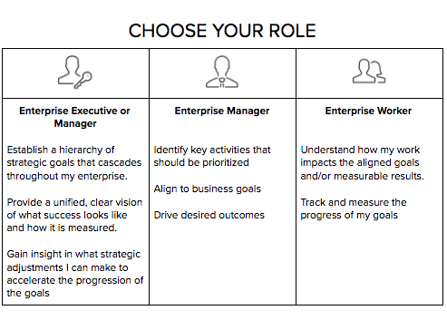

# Konfigurera [!UICONTROL Workfront-mål] för din organisation

*Det här avsnittet är avsett för [!DNL Workfront] systemadministratörer som ansvarar för att ställa in Workfront-mål för sina användare.*

För att garantera att organisationen går framåt snabbt måste du vara säker på att utförandet av arbetet är anpassat till företagets strategi. [!DNL   Goals] samordnar strategi, mål och arbete för att driva verksamheten framåt i hela organisationen och leverera mätbara affärsresultat.

Bästa praxis börjar med företagsmål på högsta nivå och går sedan vidare till grupp, team och individuella nivåer. Målen måste vara anpassade till, bidra till och stödja uppnåendet av företagsprioriteringar. I [!DNL Workfront], stöds mål av resultat eller aktiviteter som visar hur du uppnår dem.

## [!DNL Workfront Goals] checklista

Följande villkor måste vara uppfyllda innan du kan komma åt [!DNL   Goals]:

* Din organisation måste köpa en [!DNL Workfront Goals] utöver [!DNL Workfront] licens.
* Din organisation måste använda den nya [!DNL Workfront] upplevelsegränssnitt. [!DNL Workfront Goals] är inte tillgängligt i klassiska [!DNL Workfront] gränssnitt.
* Dina [!DNL Workfront Goals] användare måste ges åtkomst till [!DNL Workfront Goals] på deras åtkomstnivå.
* Du måste tilldela en layoutmall som innehåller [!DNL Workfront Goals] på huvudmenyn så att användarna får tillgång till funktionerna.

## Vem kan använda [!DNL Workfront Goals]

Även om enskilda medarbetare ofta har personliga mål rekommenderar vi att du använder [!DNL Workfront Goals] för att stödja organisationens arbete med att uppnå strategiska mål. Alla i organisationen bör uppmuntras att sätta upp mål som är anpassade till den övergripande företagsstrategin och som har samband med deras dagliga verksamhet.

Läs rollbeskrivningarna nedan och se vilken roll du har [!DNL Workfront Goals].

Chefer och chefer kan använda [!DNL Workfront Goals] till:

* Upprätta en hierarki av strategiska mål som överlappar hela företaget.
* Ge en enhetlig, tydlig bild av hur framgången ser ut och hur den mäts.
* Få insikter i vilka strategiska justeringar som kan göras för att påskynda utvecklingen av målen.

Enskilda medarbetare kan använda [!DNL Workfront Goals] till:

* Anpassa deras mål efter företagets övergripande strategiska initiativ.
* Mät deras framsteg och resultat när det gäller strategiska mål.
* Justera de personliga målen efter behov för att anpassa dem till företagets inriktning.

