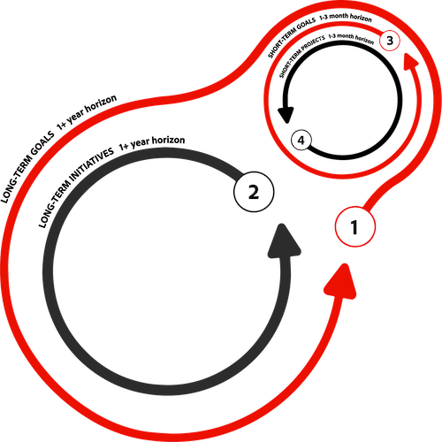

# Skapa en vision och strategi för din organisation

I den här videon får du lära dig mer om:

* Beskriv vad och varför under planeringsfasen
* Exempelmål
* Influensans omfattning

>[!VIDEO](https://video.tv.adobe.com/v/335185/?quality=12&learn=on)

## Planera en gräns för regelbundna kontroller och underhåll

Din beredskap för planering av ceremonier, aktiviteter och övervakning är lika viktig som detaljerna i själva planen. Modern planering är kontinuerlig och fluktuerande. Ni bör förutse övervakning, granskning och anpassning längs vägen. Om du gör det kan du göra rätt i kursen för att justera tillbaka till önskat resultat.

Justering är beroende av att man skapar en kultur som kan släppa loss de icke-slagkraftiga arbetsinsatserna. Oftast blir våra projekt och deras slutförande vår enda fokus. Även om vi kan driva på slutförandet av arbetet kan detta leda till det yttersta misslyckandet med att uppnå slutmålet eftersom arbetet inte längre är relevant för det ursprungliga resultatet.

En traditionell gräns för en långsiktig/kortsiktig planeringscykel kan vara 12 månader/3 månader. Eller så kan det vara sex månader i månaden eller något annat.

Tänk på dessa begrepp när du avgör vilken grund du ska ha för organisationen.

* I dagens affärsmiljö är interna och externa faktorer mer instabila och förändras ofta. För att hantera dessa faktorer strategiskt bör översynen och justeringen av de kortare målen vara minst var tredje månad.

* Varje granskning bör omfatta tid för att reflektera över tidigare genomföranden och insatser och utvärdera affärsplanen för framtiden. Fråga dig själv och dina team ... är vi fortfarande på rätt spår?

Följande bild visar relationen och den cykliska karaktären hos denna konferens, inte bara mellan längre och kortare mål, utan längre och kortare arbetsinsatser.

1. **Långsiktiga mål** är vanligtvis bredare mål för företag eller organisationer som kommer att ta 12 eller fler månader att uppnå. De kan inte åstadkommas med enastående arbetsinsatser. De flesta företag och organisationer har ett par nivåer av dessa långsiktiga mål överst i hierarkin som förenar kortsiktiga mål inom ett enda, brett mål.
1. **Långsiktiga initiativ** representerar en högnivåuppskattning av arbetsinsatsen som är mappad ut för att driva verksamheten framåt. Dessa initiativ kommer i slutändan att vidareutvecklas till mer konsumerbara arbetsinsatser (t.ex. projekt, uppgifter osv.). Dessa är vanligtvis längre arbetsinsatser, till exempel 12 eller fler månader, men i vissa fall kan de vara en gruppering av flera 6 eller fler månadslånga initiativ som motsvarar samma resultat.
1. **Kortsiktiga mål** är de mål som fastställts av era medarbetare och team och som anpassar sig till fler milstolpe-typsresultat. Alla dessa segmenterade resultat bidrar till att företagets eller organisationens långsiktiga mål uppnås överlag.
1. **Kortsiktiga projekt** hänvisa till det mer begränsade arbetsområde som krävs för att uppnå de kortsiktiga målen. Dessa kan antingen vara enstaka projekt eller projekt som ingår i ett större initiativ.

<!--
Your turn graphic
-->

Låt oss öva lite på och tillämpa det du lärt dig hittills. Börja med att kartlägga en första uppsättning mål för teamet. Du kan ha hört detta kallas för övergripande mål eller en målhierarki. Se hur de alla länkar tillbaka till det långsiktiga målet och överlappar därifrån. Bry dig inte om att vara för definitiv i den här fasen. Det här är din chans att få ut alla dina mål på bordet. Vi kommer att finjustera de här ännu mer.

