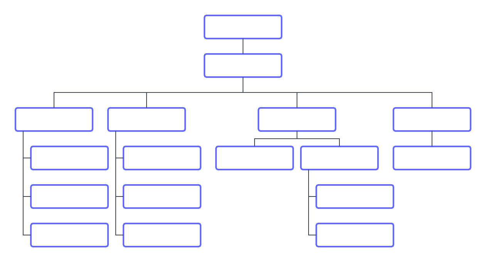

# Förstå hur [!DNL Workfront Goals] fungerar

I den här videon får du lära dig mer om:

* Beskriv vad och varför under planeringsfasen
* Exempelmål
* Influensans omfattning

>[!VIDEO](https://video.tv.adobe.com/v/335183/?quality=12&learn=on)

## Utse ansvariga personer

Innan du börjar konfigurera [!DNL Workfront Goals] måste du identifiera de personer i organisationen som ska vara ansvariga för att ha lett till varje mål.

Det finns några sätt att göra detta på. [!DNL Workfront] rekommenderar att du skissar upp organisationsschemat. Det kommer sannolikt att finnas flera skikt av målägare. Börja med ledarskap på toppnivå och identifiera sedan de team och teammedlemmar som ansvarar för att utföra det arbete som krävs för att leverera önskat resultat. De behöver en kontext över vilka mål de arbetar mot för att kunna producera sitt bästa.

Ta sedan ett steg tillbaka och titta på era medarbetare. Bestäm vem som behöver fullständig hanterings-/redigeringsåtkomst, endast åtkomst och ingen åtkomst alls. Antalet utan tillgång bör vara relativt litet, eftersom de flesta åtminstone måste se målen för det strategiska sammanhanget.

>[!NOTE]
>
>När du identifierar de primära målägarna bör du tänka på att du sätter upp strategiska mål för företagsresultat, inte för personliga utvecklingsmål. Workfront rekommenderar att du bara lägger till utvecklingsmål som direkt bidrar till eller driver affärs- och företagsmålen.

Vi visar dig hur du konfigurerar och konfigurerar dina inställningar i [!DNL Workfront Goals], del 2: Skapa och hantera dina mål.

<!--
URL for part 2 reference above
-->
